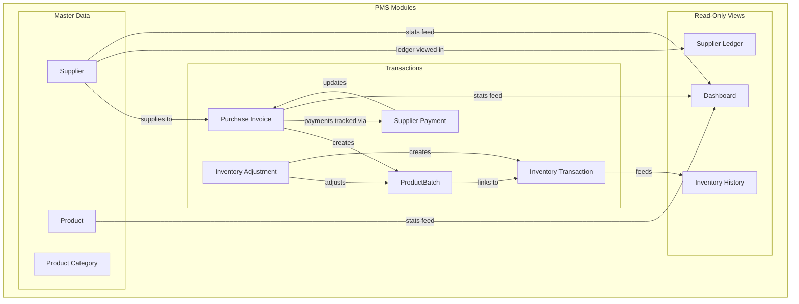
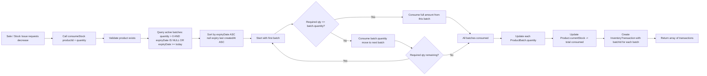

# PMS Bugfix & Architecture Improvement Plan

## Purpose

This document captures all verified issues found in the current PMS implementation, distinguishes them from outdated claims in earlier planning documents, and defines the actual fixes required before the system is considered production-ready.

**Guiding principle:** Do not rebuild the PMS. Do not change the existing Patient/Invoice/Prescription workflow. Harden the existing implementation. Batch/expiry tracking is a required Phase 1 feature for a medicine PMS, not a future enhancement.

### PMS Isolation Rule

The PMS module is completely independent of the existing Patient Management, Patient Invoice/Billing, Prescription, and other clinical modules.

- No PMS table may have a foreign-key relationship to Patient, Patient Invoice, Prescription, or other existing clinical tables.
- No existing patient/billing/prescription API may call PMS inventory APIs.
- No PMS API may call or depend on existing patient/billing/prescription APIs.
- Existing patient invoices must NOT automatically create SALE inventory transactions.
- Existing prescriptions must NOT automatically reserve or deduct PMS stock.
- Patient records must NOT be required to create, purchase, adjust, or consume PMS inventory.
- PMS inventory can operate independently using Product, ProductCategory, Supplier, PurchaseInvoice, PurchaseInvoiceItem, SupplierPayment, ProductBatch, BatchReceipt, InventoryTransaction, and InventoryAdjustment data only.

This means the existing clinical system and the PMS are separate domains with no database or API coupling during Phase 1.

---

## Audit Summary

| Category | Count | Issues |
|----------|-------|--------|
| Already fixed in code | 7 | Duplicate APIs, race condition, sign convention, quantity validation, Decimal handling, sequence prefix, dashboard labeling |
| Real bugs / gaps requiring fix | 12 | No shared InventoryService, purchase correction double-stock, payment concurrency, OVERDUE unused, opening balance not in ledger, misleading "zero changes" claim, no invoice correction workflow, inventory valuation methodology, no batch/expiry tracking, missing product GST validation, mixed responsibilities, batch-level stock not tracked |
| Phase-1 acceptable with documentation | 1 | Manual SALE adjustment |

---

## Section 1: Issues Already Fixed (Verified in Code)

These were flagged in older planning documents but have already been corrected in the actual implementation.

| # | Issue | Status | Evidence |
|---|-------|--------|----------|
| 1 | Duplicate inventory API (`POST /api/inventory-transactions` still exposed) | ✅ Fixed | `app/api/inventory-transactions/route.ts` is GET-only. Writes go through `POST /api/inventory-adjustments`. |
| 3 | Inventory race condition (check-then-update without atomicity) | ✅ Fixed | `app/api/inventory-adjustments/route.ts:100-106` uses `updateMany` with `currentStock: { gte: qty }`. |
| 10 | Quantity sign convention (frontend decides sign) | ✅ Fixed | Frontend always sends positive quantity. Backend applies sign: `isDecrease ? qty.times(-1) : qty`. |
| 11 | Quantity validation missing (`quantity <= 0` accepted) | ✅ Fixed | Both `purchase-invoices/route.ts:171` and `inventory-adjustments/route.ts:87` validate `lessThanOrEqualTo(0)`. |
| 12 | Decimal/Number mixing in business logic | ✅ Fixed | Business logic uses `Prisma.Decimal`. `toNumber()` is only applied at JSON response boundaries. |
| 13 | Sequence prefix derived via `name.slice(0,4)` | ✅ Fixed | `lib/api-helpers.ts:70-111` uses explicit `prefixMap`: `PINV`, `PPAY`, `SINV`, `PRD`. |
| 19 | Dashboard "Today's Purchase" ambiguous (paid vs grandTotal) | ✅ Fixed | Dashboard sums `grandTotal` for `todayPurchase` and `monthlyPurchase`. Labeling is correct. |

**Action required:** None. Older documents (`PMS_INVENTORY_ADJUSTMENT_PLAN.md`, early draft notes) that describe these bugs should be treated as superseded by the current code.

---

## Section 2: Real Bugs and Gaps Requiring Fixes

### 🔴 P0 — Critical (Fix Before Production)

#### 2.1 No Shared Inventory Service

**Problem:**  
Stock mutations are implemented independently in two places:
- `app/api/purchase-invoices/route.ts:190-196` — updates `currentStock` + creates `PURCHASE` transaction
- `app/api/inventory-adjustments/route.ts:100-130` — updates `currentStock` + creates adjustment transaction

There is no single `InventoryService.adjustStock()`. This means:
- Future developers may update stock in one path but forget the transaction in another.
- Business rules (e.g., negative stock prevention, transaction type mapping) are duplicated and can drift.

**Fix:**
1. Create `lib/inventory-service.ts` with two exported operations:
   ```ts
   // For purchase receipts — creates/updates batch and stock atomically
   export async function receiveStock(params: {
     productId: string
     quantity: PositiveDecimal
     batchId?: string | null
     batchNumber: string
     supplierId: string
     purchaseInvoiceId: string
     expiryDate?: DateTime | null
     purchaseRate: PositiveDecimal
     referenceType?: ReferenceType
     referenceId?: string | null
     notes?: string | null
   }): Promise<InventoryTransaction>

    // For manual adjustments — targets a specific batch
    export async function adjustStock(params: {
      productId: string
      type: TransactionType
      quantity: PositiveDecimal
      batchId: string
      unitCost?: PositiveDecimal
      referenceType?: ReferenceType
      referenceId?: string | null
      notes?: string | null
    }): Promise<InventoryTransaction>

   // For sales / stock issuance — automatically selects batches using FEFO
   export async function consumeStock(params: {
     productId: string
     quantity: PositiveDecimal
     referenceType?: ReferenceType
     referenceId?: string | null
     notes?: string | null
   }): Promise<InventoryTransaction[]>
   ```
2. `receiveStock()` must:
   - Validate product exists
   - If `batchId` provided: validate batch exists and belongs to product
    - If `batchId` not provided: check if `productId + batchNumber` combo exists
      - If exists: update existing `ProductBatch.quantity += quantity` (expiry validated against batch)
      - If not: create new `ProductBatch` with all supplied fields
   - Create a `BatchReceipt` with `quantity = receivedQty`, `remainingQuantity = receivedQty`, `purchaseRate = supplied rate`
   - Update `Product.currentStock += quantity`
   - Create `InventoryTransaction` with `type: 'PURCHASE'` and `batchId`
   - All in one `$transaction`
3. `adjustStock()` must:
   - Validate product exists
   - **Require `batchId` for all operations** (no batch-less increase or decrease)
   - **Require `unitCost` for increases; optional for decreases** — for increases, becomes the `purchaseRate` on the created/updated `BatchReceipt` layer; for decreases, if omitted, derive cost from the FIFO receipt layers being reduced
   - Validate batch exists and belongs to product
   - For increases: create or update a `BatchReceipt` layer for the batch with `remainingQuantity += qty`, `purchaseRate = unitCost`
   - For decreases: use atomic `updateMany` on `ProductBatch` with `quantity >= qty`
   - For decreases: also use atomic `updateMany` on each affected `BatchReceipt` with `remainingQuantity >= qtyToConsume`
   - For decreases: allocate the reduction across the batch's `BatchReceipt` records in **FIFO order by `createdAt`** — oldest receipt is reduced first
   - Update `ProductBatch.quantity` and `Product.currentStock` together with receipt layer updates
   - Create `InventoryTransaction` in same `$transaction`
4. `consumeStock()` must:
   - Validate product exists
   - Query active batches (`quantity > 0` AND `expiryDate IS NULL OR expiryDate >= today`)
   - Sort by `expiryDate ASC` (null expiry last), then `createdAt ASC`
   - For each batch to consume, allocate across the batch's `BatchReceipt` records in **FIFO order by `createdAt`** — oldest receipt is consumed first
   - Update each `BatchReceipt.remainingQuantity` and `ProductBatch.quantity`
   - Update `Product.currentStock`
   - Create `InventoryTransaction` per batch consumed
   - All in one `$transaction`
5. Update `purchase-invoices/route.ts` to call `receiveStock()` instead of inline batch + stock logic.
6. Update `inventory-adjustments/route.ts` to call `adjustStock()` for manual adjustments.
7. A separate future PMS Product Billing module may call `consumeStock()` for automatic sale deductions. The existing Patient Invoice/Billing system will remain permanently independent.

**Files changed:**
- `lib/inventory-service.ts` (new)
- `app/api/purchase-invoices/route.ts`
- `app/api/inventory-adjustments/route.ts`

**Critical invariants:**
- `receiveStock()` is the ONLY entry point for purchase-related batch creation and stock increase
- `adjustStock()` is the ONLY entry point for manual batch-level adjustments
- `consumeStock()` is the ONLY entry point for sale/issuance decreases
- No API route may directly update `Product.currentStock` or `ProductBatch.quantity` for inventory movements
- Batch quantity and product stock are always updated together in the same transaction
- Every stock increase or decrease must also update `BatchReceipt.remainingQuantity` to keep valuation consistent with physical stock
- Within a batch, stock decreases are allocated to `BatchReceipt` records in FIFO order by `createdAt`
- Manual increases require `batchId` and `unitCost`, and create/update a `BatchReceipt` layer with `remainingQuantity += qty` and `purchaseRate = unitCost`
- For manual decreases, `unitCost` is optional; if omitted, the effective cost is derived from the FIFO receipt layers being reduced
- Each `BatchReceipt.remainingQuantity` update uses atomic `updateMany` with `remainingQuantity >= qtyToConsume` to prevent partial over-consumption at the receipt layer

---

#### 2.2 Payment Concurrency Race Condition

**Problem:**  
`app/api/supplier-payments/route.ts:86-103` reads invoice balance, validates `amount <= balance`, then updates. Two simultaneous payments can both read the same old balance and both pass validation.

Example:
- Invoice balance = ₹10,000
- User A pays ₹7,000
- User B pays ₹7,000
- Both read balance 10,000 → both pass → final balance = -4,000

**Fix:**
1. Use an **explicit atomic conditional update** on `PurchaseInvoice` as the primary guard:
   ```ts
   const updated = await tx.purchaseInvoice.updateMany({
     where: {
       id: invoiceId,
       balance: { gte: amountDecimal },
     },
     data: {
       paid: { increment: amountDecimal },
       balance: { decrement: amountDecimal },
     },
   })
   if (updated.count === 0) {
     throw new ValidationError(`Payment amount exceeds outstanding balance`)
   }
   ```
2. Wrap the payment creation and invoice update in `prisma.$transaction`.
3. After the atomic update succeeds, create the `SupplierPayment` record.
4. Compute the new status from the updated invoice values and save it.
5. Do NOT rely solely on re-reading the invoice after `$transaction` starts; the conditional `updateMany` is the actual concurrency guard.

**Files changed:**
- `app/api/supplier-payments/route.ts`

**Verification:** Test with two concurrent payment requests against the same invoice to confirm no overpayment is possible.

---

#### 2.3 OVERDUE Status Is Unused

**Problem:**  
`PaymentStatus` enum includes `OVERDUE`, but `supplier-payments/route.ts:109-113` only computes `PENDING`, `PARTIAL`, or `PAID`. `OVERDUE` is never written. The dashboard also only checks `PENDING` and `PARTIAL` for pending payments.

**Fix:**
1. Add a helper function:
   ```ts
   function computePaymentStatus(
     balance: Prisma.Decimal,
     paid: Prisma.Decimal,
     dueDate: Date | null
   ): 'PENDING' | 'PARTIAL' | 'PAID' | 'OVERDUE'
   ```
   Rules:
   - `balance <= 0` → `PAID`
   - `balance > 0 && dueDate && dueDate < today` → `OVERDUE`
   - `paid > 0 && balance > 0` → `PARTIAL`
   - else → `PENDING`

2. Use this helper in `supplier-payments/route.ts` when updating invoice status.

3. Update dashboard `pendingPayments` query to include `OVERDUE` invoices:
   ```ts
   where: { status: { in: ['PENDING', 'PARTIAL', 'OVERDUE'] } }
   ```

4. Add a periodic update mechanism. OVERDUE status cannot depend only on payment events, because an invoice can become overdue simply because the date passes. For a small PMS, a helper function plus a lightweight scheduled job or cron to recompute `OVERDUE` status daily for existing invoices is reasonable.

**Files changed:**
- `app/api/supplier-payments/route.ts`
- `app/api/dashboard/route.ts`
- `lib/payment-status.ts` (new)

---

#### 2.4 Supplier openingBalance Not Reflected in Ledger

**Problem:**  
`Supplier.openingBalance` exists but no ledger calculation includes it. The supplier ledger (`GET /api/suppliers/[id]`) does not yet exist, but when built, the formula must be explicit:
```
outstandingBalance = openingBalance + totalPurchases - totalPayments
```
Without this, `openingBalance` is dead data.

**Fix:**
1. When building the supplier ledger endpoint, compute:
   ```ts
   const totalPurchases = await prisma.purchaseInvoice.aggregate({
     where: { supplierId },
     _sum: { grandTotal: true },
   })
   const totalPayments = await prisma.supplierPayment.aggregate({
     where: { supplierId },
     _sum: { amount: true },
   })
   const openingBalance = new Prisma.Decimal(supplier.openingBalance)
   const outstanding = openingBalance.plus(totalPurchases._sum.grandTotal || 0).minus(totalPayments._sum.amount || 0)
   ```
2. Document this formula in the API response so frontend developers understand the components.
3. Ensure `SupplierPayment` for opening balance adjustments uses a distinct `referenceType` or notes so the audit trail is clear.

**Files changed (when building supplier ledger):**
- `app/api/suppliers/[id]/route.ts` (new)
- `app/api/suppliers/route.ts` (update GET to include ledger fields)

**Note:** Do not add `gstPercentApplied` to `PurchaseInvoiceItem` at this time. The invoice already stores immutable `subtotal`, `tax`, and `grandTotal`, which is sufficient for historical reporting unless detailed line-level historical GST reporting is actually required.

---

### 🟠 P1 — High (Fix During Current Phase)

#### 2.5 Purchase Correction Can Double-Adjust Stock

**Problem:**  
Adjustment reason "Purchase Correction" allows staff to manually increase stock after a purchase invoice already increased it. The system has no guard against duplicate stock entry.

**Fix:**
1. **Remove "Purchase Correction" from the adjustment reasons dropdown.** This is the preferred Phase 1 approach.
2. Document that purchase corrections must be handled by a controlled future reversal workflow, not by manual stock adjustment.
3. Do not implement arbitrary manual balance edits as a workaround for wrong invoices.

**Files changed:**
- `app/inventory-adjustments/page.tsx` (remove reason from dropdown)
- `PMS_IMPLEMENTATION_PLAN.md` (add note)

---

#### 2.6 No Invoice Correction / Cancellation Workflow

**Problem:**  
Once a purchase invoice is created, there is no way to correct it if the quantity or product was entered incorrectly. The invoice is effectively immutable with no reverse mechanism.

**Fix:**
1. For Phase 1, document that purchase invoices are immutable after creation.
2. The only supported path for a wrong invoice is to wait for a proper "Reverse Invoice" workflow in a future phase.
3. Do NOT allow editing, deleting, or ad-hoc manual balance adjustments in Phase 1.

**Files changed:**
- `PMS_IMPLEMENTATION_PLAN.md` (add immutability note)

---

#### 2.7 Inventory Valuation — Use Receipt-Layer Costing

**Old problem (now resolved):**  
Previously, inventory value was calculated as `currentStock × latest purchasePrice`, which revalued all stock at the most recent purchase rate.

**Current solution:**  
With `ProductBatch` and `BatchReceipt` tracking, inventory value is now calculated as:
```
sum(BatchReceipt.remainingQuantity × BatchReceipt.purchaseRate)
for all BatchReceipt records where remainingQuantity > 0
```

This is more accurate because each receipt retains its actual purchase rate and remaining quantity. It provides true stock-layer costing.

**Fix:**
1. Dashboard label should simply read:
   ```
   Inventory Value
   ```
2. Dashboard calculation uses receipt-layer costing from `BatchReceipt` table
3. No need for "Latest Purchase Price" qualifier — the receipt model provides true cost per stock layer

**Files changed:**
- `app/api/dashboard/route.ts` (use receipt-based calculation)
- `app/page.tsx` (label = "Inventory Value")

---

#### 2.8 No GST Validation on Product Create/Update

**Problem:**  
`app/api/products/route.ts:93-108` accepts any `gstPercent` value, including invalid ones like `150` or `-5`. Validation only happens later at purchase invoice creation, which means corrupt master data can persist.

**Fix:**
1. Add GST validation in `app/api/products/route.ts` POST handler:
   ```ts
   const gst = new Prisma.Decimal(body.gstPercent ?? 0)
   if (gst.lessThan(0) || gst.greaterThan(100)) {
     return NextResponse.json({ error: 'GST percent must be between 0 and 100' }, { status: 400 })
   }
   ```
2. Add the same validation in the PATCH handler (`app/api/products/[id]/route.ts`) if it exists.
3. This should be implemented as part of Phase 1, together with the GST calculation fix, so that purchase invoice GST logic can safely trust product master data.

**Files changed:**
- `app/api/products/route.ts`
- `app/api/products/[id]/route.ts` (if exists)

---

#### 2.9 Manual SALE Adjustment Creates Double-Deduct Risk

**Problem:**  
Staff can currently create `SALE` type adjustments manually. When a separate future PMS Product Billing module is implemented, automatic `SALE` transactions will be created from that module's invoices. If manual SALE adjustments are still allowed, stock could be deducted twice for the same sale. The existing Patient Invoice/Billing system will never connect to PMS inventory.

**Fix:**
1. Keep manual `SALE` adjustment available for Phase 1, since the existing Patient Invoice/Billing system will never connect to PMS inventory.
2. Add a feature flag or environment check:
    ```ts
    const allowManualSale = process.env.ALLOW_MANUAL_SALE_ADJUSTMENT !== 'false'
    ```
3. Document the explicit transition plan with strict ordering:
    - **Phase 1:** `SALE` adjustment type is available for manual stock deduction via `adjustStock()`.
    - **Phase 2 step 1:** Disable/remove manual `SALE` adjustment type from `inventory-adjustments/route.ts` and UI.
    - **Phase 2 step 2:** Activate automatic SALE deduction from the PMS Product Billing module via `consumeStock()`.
    - **Critical:** Manual SALE must be disabled BEFORE the PMS Product Billing module activates automatic deduction. Never allow both simultaneously.
4. When the separate future PMS Product Billing module is implemented, remove `SALE` from the `validTypes` list in `inventory-adjustments/route.ts`.

**Files changed:**
- `app/api/inventory-adjustments/route.ts` (add feature flag)
- `app/inventory-adjustments/page.tsx` (conditionally show SALE reason)
- `PMS_IMPLEMENTATION_PLAN.md` (add transition note with ordering requirement)

---

#### 2.11 No Batch/Expiry Tracking — CRITICAL FOR PHARMACY PMS

**Problem:**  
The system currently tracks stock only at the `Product` level:

```
Product: Paracetamol
currentStock = 200
```

It cannot represent:

```
Product: Paracetamol
├── Batch PCM001 → 100 units → Supplier: Medico Pharma → Rate: ₹8 → Expiry: 30-Dec-2026
└── Batch PCM002 → 100 units → Supplier: HealthCare Distributors → Rate: ₹9 → Expiry: 31-Mar-2027
```

This means the system cannot answer:
- Which batch expires next?
- How many units of Batch PCM001 remain?
- Which supplier provided a specific batch?
- What was the actual purchase rate for remaining stock?
- Which batches are expiring in the next 30/7 days?

For a medicine PMS, batch/expiry tracking is not optional — it is a core functional requirement.

**Current limitation:**
- `InventoryTransaction` has no `batchId` field, so history shows only `Paracetamol | EXPIRED | -10` instead of `Paracetamol | Batch PCM001 | EXPIRED | -10`
- Adjustments cannot target a specific batch, so staff can accidentally reduce stock from the wrong batch
- No FEFO (First Expiry, First Out) logic exists
- No expiry alerts or dashboard widgets for expiring/expired stock
- Inventory valuation uses `currentStock × latest purchasePrice` instead of batch-level costing

**Fix:**

##### 2.11.1 Add `ProductBatch` and `BatchReceipt` Models

Add to `prisma/schema.prisma`:

```prisma
model ProductBatch {
  id         String   @id @default(uuid())
  productId  String
  batchNumber String
  expiryDate  DateTime?
  createdAt  DateTime  @default(now())

  product   Product           @relation(fields: [productId], references: [id])
  receipts  BatchReceipt[]
  transactions InventoryTransaction[]

  @@index([productId])
  @@index([expiryDate])
  @@unique([productId, batchNumber])
}

model BatchReceipt {
  id                String   @id @default(uuid())
  batchId           String
  supplierId        String
  purchaseInvoiceId String?
  sourceType        BatchReceiptSource
  sourceId          String?
  quantity          Decimal
  remainingQuantity Decimal
  purchaseRate      Decimal
  createdAt         DateTime  @default(now())

  batch           ProductBatch   @relation(fields: [batchId], references: [id])
  supplier        Supplier      @relation(fields: [supplierId], references: [id])
  purchaseInvoice PurchaseInvoice? @relation(fields: [purchaseInvoiceId], references: [id])

  @@index([batchId])
  @@index([purchaseInvoiceId])
  @@index([supplierId])
}

enum BatchReceiptSource {
  PURCHASE
  ADJUSTMENT
  OPENING
}
```

**Key design decisions:**
- `ProductBatch` represents the physical/manufacturer batch identity: product, batch number, expiry.
- `BatchReceipt` represents each purchase/adjustment event for that batch: supplier, invoice, quantity, remaining quantity, rate.
- `supplierId` lives on `BatchReceipt`, not `ProductBatch`, so the same manufacturer batch can be purchased from different suppliers over time.
- `purchaseInvoiceId` is nullable because manual adjustments and opening stock do not originate from a purchase invoice.
- `sourceType` identifies whether a receipt came from a purchase, manual adjustment, or opening stock entry.
- `expiryDate` is **nullable** (`DateTime?`). Opening stock batches and non-perishable items may not have an expiry.
- `@@unique([productId, batchNumber])` on `ProductBatch` — batch number is unique per product.
- A product can have multiple batches. A batch can have multiple receipts across different invoices/suppliers/adjustments.
- This preserves full purchase history even when the same manufacturer batch is purchased multiple times.

##### 2.11.2 Add `batchId` to `InventoryTransaction`

Update `InventoryTransaction` model:

```prisma
model InventoryTransaction {
  id           String            @id @default(uuid())
  productId    String
  batchId      String?
  type         TransactionType
  quantity     Decimal
  referenceType ReferenceType?
  referenceId  String?
  notes        String?
  createdAt    DateTime          @default(now())

  product Product @relation(fields: [productId], references: [id])
  batch  ProductBatch? @relation(fields: [batchId], references: [id])

  @@map("inventory_transactions")
  @@index([productId, type])
  @@index([referenceType, referenceId])
  @@index([batchId])
}
```

##### 2.11.3 Define `currentStock` and `availableStock`

**`Product.currentStock`** = total physical quantity across all batches for the product, including expired batches.

```
currentStock = sum(ProductBatch.quantity WHERE productId = X)
```

**`availableStock`** = sellable quantity (excluding expired batches).

```
availableStock = sum(ProductBatch.quantity WHERE productId = X AND (expiryDate IS NULL OR expiryDate >= today))
```

The product page should display both:
- **Total Stock:** 150 (physical count)
- **Available Stock:** 100 (sellable)
- **Expired Stock:** 50 (cannot be sold)

Valuation for these counts is computed from `BatchReceipt` records — see Section 2.11.9.

##### 2.11.4 Handle Repeated Purchase of Same Batch

When a purchase invoice is created with a batch number that already exists for the product:

| Scenario | Action |
|----------|--------|
| Same product + same batchNumber | Update existing `ProductBatch` — do not create duplicate |
| Same batch, same supplier, same expiry | Add `BatchReceipt` with new invoice, increase batch `quantity` |
| Same batch, different supplier | **Allowed** — create new `BatchReceipt` with different `supplierId`; `ProductBatch` remains unchanged |
| Same batch, different expiry | **Reject** with error: "Batch number already exists with a different expiry date" |

The `BatchReceipt` table preserves the history of each purchase event for the same physical batch.

##### 2.11.4a Receipt-Layer Allocation Rule

Every stock decrease must keep `BatchReceipt.remainingQuantity` synchronized with physical stock.

**Rule:** Within a `ProductBatch`, stock decreases are allocated to `BatchReceipt` records in **FIFO order by `createdAt`** — the oldest receipt is reduced first.

This applies to:
- `consumeStock()` — FEFO consumption
- `adjustStock()` with decrease types (`ADJUSTMENT_OUT`, `DAMAGED`, `EXPIRED`, `LOST`)
- Any future stock-issuance operation

**Example:**
```
Batch PCM001
  Receipt A: createdAt=2026-01-01, remainingQuantity=100, purchaseRate=8
  Receipt B: createdAt=2026-02-01, remainingQuantity=50, purchaseRate=8.50
  ProductBatch.quantity = 150

Decrease by 20
→ Receipt A.remainingQuantity: 100 → 80
→ Receipt B.remainingQuantity: 50 → 50 (unchanged)
→ ProductBatch.quantity: 150 → 130
```

**Example:**
```
Decrease by 120
→ Receipt A.remainingQuantity: 100 → 0
→ Receipt B.remainingQuantity: 50 → 30
→ ProductBatch.quantity: 150 → 30
```

##### 2.11.5 Handle Expired Stock

**Expiry status is computed dynamically, not stored.**

```ts
function getBatchStatus(expiryDate: DateTime | null): 'EXPIRED' | 'EXPIRING_SOON' | 'OK' | 'NO_EXPIRY' {
  if (!expiryDate) return 'NO_EXPIRY'
  if (expiryDate < today) return 'EXPIRED'
  if (expiryDate < today + 30 days) return 'EXPIRING_SOON'
  return 'OK'
}
```

**Rules:**
- Expired batches cannot be sold or issued via `consumeStock()` — FEFO excludes them.
- Expired batches CAN be written off via `adjustStock()` with `type: 'EXPIRED'` and explicit `batchId`.
- When `type: 'EXPIRED'` is used: batch quantity → 0, product currentStock decreases, `BatchReceipt.remainingQuantity` for the batch is reduced to 0 via FIFO allocation, `InventoryTransaction` records the write-off.
- Do NOT prevent further adjustments on expired batches. Staff need to write them off.

**Expiry requirement rule:**
- Medicine/consumable products: `batchNumber` REQUIRED, `expiryDate` REQUIRED
- Non-expiring products (equipment, etc.): `batchNumber` may be required, `expiryDate` OPTIONAL
- The backend must allow `expiryDate` to be null at the database level
- The UI should enforce expiry requirement based on product category or type

##### 2.11.6 Update Purchase Invoice Flow to Create Batches

When a purchase invoice is created:
1. Create `PurchaseInvoice` record
2. Create `PurchaseInvoiceItem` records
3. For each item, call `InventoryService.receiveStock()` with:
   - `productId`, `quantity`, `batchNumber`, `supplierId`, `purchaseInvoiceId`, `expiryDate`, `purchaseRate`
4. `receiveStock()` will:
   - Check if `ProductBatch` with same `productId + batchNumber` exists
   - If exists: validate expiry matches batch expiry (if batch has expiry), then `quantity += newQty`
   - If not: create new `ProductBatch`
   - Create `BatchReceipt` with `remainingQuantity = quantity`, `purchaseRate = supplied rate`, `supplierId = supplied supplier`, linking the batch to this purchase invoice
   - Update `Product.currentStock += quantity`
   - Create `InventoryTransaction` with `type: 'PURCHASE'` and `batchId`
5. All steps happen inside a single `prisma.$transaction`

**Critical:** The route handler must NOT create `ProductBatch` directly. `receiveStock()` is the ONLY entry point for purchase stock receipt. The batch quantity is updated exactly once inside the service.

##### 2.11.7 Implement FEFO (First Expiry, First Out)

`consumeStock()` is the only entry point for sale/stock-issuance decreases:

1. Query all batches for the product where `quantity > 0` AND (`expiryDate IS NULL` OR `expiryDate >= today`)
2. Sort by `expiryDate ASC` (null expiry dates last), then `createdAt ASC`
3. For each batch to consume, perform **atomic conditional update**:
   ```
   UPDATE ProductBatch 
   SET quantity = quantity - :qtyToConsume 
   WHERE id = :batchId AND quantity >= :qtyToConsume
   ```
4. Check affected rows count. If 0, another transaction consumed the stock — retry or fail with "Insufficient stock"
5. Within each consumed batch, allocate the reduction across `BatchReceipt` records in **FIFO order by `createdAt`** — oldest receipt is reduced first
6. For each receipt, perform **atomic conditional update**:
   ```
   UPDATE BatchReceipt 
   SET remainingQuantity = remainingQuantity - :qtyToConsume 
   WHERE id = receiptId AND remainingQuantity >= :qtyToConsume
   ```
7. Check affected rows count. If 0, another transaction consumed the receipt stock — retry or fail with "Insufficient stock in receipt layer"
8. Consume from earliest-expiring batch first, moving to next batch as needed
9. If required quantity spans multiple batches, consume from each and create separate `InventoryTransaction` records
10. Update `Product.currentStock` -= total consumed
11. All updates in the same `$transaction`

**Concurrency rule:** Each batch update uses atomic `updateMany` with `quantity >= qtyToConsume`. This prevents two concurrent sales from both consuming the same batch stock.

**Receipt-level concurrency rule:** Each receipt update uses atomic `updateMany` with `remainingQuantity >= qtyToConsume`. This prevents partial over-consumption at the receipt layer when two concurrent operations target the same receipt.

**Receipt allocation rule:** Within a batch, stock decreases are allocated to `BatchReceipt.remainingQuantity` in FIFO order by `createdAt`. This ensures inventory valuation remains mathematically consistent with physical stock.

##### 2.11.8 Add Expiry Monitoring

Compute expiry status dynamically from `expiryDate` — no status field needed.

Dashboard widgets:
- `expiredStockValue` = sum of `BatchReceipt.remainingQuantity × BatchReceipt.purchaseRate` for batches where `expiryDate < today`
- `expiringSoonCount` = count of batches where `expiryDate >= today` AND `expiryDate < today + 30 days`
- `expiringSoonValue` = sum of `BatchReceipt.remainingQuantity × BatchReceipt.purchaseRate` for batches where `expiryDate >= today AND expiryDate < today + 30 days`

Product page batch table:
- Columns: Batch Number, Supplier, Qty, Avg Cost, Expiry, Status
- Status badges: EXPIRED (red), EXPIRING_SOON (yellow), OK (green), NO_EXPIRY (gray)

##### 2.11.9 Update Inventory Valuation

**Option B — Recommended:** Track `remainingQuantity` on `BatchReceipt`. Each receipt records the quantity purchased and the rate. As stock is consumed, `remainingQuantity` on each receipt is reduced.

Inventory value formula:
```
inventoryValue = sum(BatchReceipt.remainingQuantity × BatchReceipt.purchaseRate)
               for all BatchReceipt records where remainingQuantity > 0
```

This is more accurate than `currentStock × latest purchasePrice` because each receipt retains its actual purchase rate. It also provides true stock-layer costing: you can see exactly how much value remains from each original purchase.

Update dashboard to compute:
```
inventoryValue = sum(BatchReceipt.remainingQuantity × BatchReceipt.purchaseRate)
               for all BatchReceipt records with remainingQuantity > 0
```

**Migration note:** The existing backfill migration (Section 2.11) that creates a synthetic "OPENING" `BatchReceipt` for existing products must also set `remainingQuantity = currentStock` and `purchaseRate = purchasePrice`.

**Files changed:**
- `prisma/schema.prisma` (add `remainingQuantity` to `BatchReceipt` model, update `InventoryTransaction`)
- `lib/inventory-service.ts` (update `receiveStock`, `adjustStock`, `consumeStock` to manage `BatchReceipt.remainingQuantity`)
- `app/api/dashboard/route.ts` (add expiry widgets, BatchReceipt-based inventory value)

**Migration path:**
1. Create migration adding `ProductBatch` table and `batchId` to `InventoryTransaction`
2. Backfill: for existing products with `currentStock > 0`, create a synthetic "OPENING" `ProductBatch` with `batchNumber = 'OPENING'`, `expiryDate = null`, `quantity = currentStock`, and a synthetic `BatchReceipt` with `quantity = currentStock`, `remainingQuantity = currentStock`, `purchaseRate = purchasePrice`
3. All new purchases create or update proper batches going forward

**Problem:**  
`PMS_IMPLEMENTATION_PLAN.md` states "Only NEW tables are added / Zero changes to existing models." However, `Product` is an existing model and the plan adds `gstPercent`, `minimumStock`, `maximumStock`, `currentStock`, `categoryId` to it.

**Fix:**
1. Update `PMS_IMPLEMENTATION_PLAN.md` to accurately state:
   > Existing clinical models remain unchanged. The existing `Product` model is extended with inventory and product-master fields: `gstPercent`, `minimumStock`, `maximumStock`, `currentStock`, `categoryId`.
2. Ensure the migration is clearly documented so DBAs understand which existing tables are altered.

**Files changed:**
- `PMS_IMPLEMENTATION_PLAN.md`

---

#### 2.12 Mixed Responsibilities (Purchase / Payment / Inventory)

**Problem:**  
Purchase invoice creation, stock updates, and payment processing are all implemented as flat route handlers. There is no service-layer separation, making it harder to enforce consistent business rules across entry points.

**Fix:**
1. For Phase 1, the current flat structure is acceptable given the small scope.
2. The priority fix is **2.1 (shared InventoryService)** which addresses the most critical overlap.
3. Consider extracting a `SupplierLedgerService` when building the supplier ledger endpoint.
4. Document the intended architecture:
   ```
   PurchaseInvoice  →  InventoryService  →  Product.currentStock + InventoryTransaction
   SupplierPayment  →  SupplierLedgerService  →  Supplier.outstandingBalance
   ```

**Files changed:**
- `lib/inventory-service.ts` (new, from fix 2.1)
- `lib/supplier-ledger-service.ts` (new, when building ledger)

---

## Section 3: Quick Reference — Fix Priority Order

| Priority | Issue | Section | Action |
|----------|-------|---------|--------|
| 🔴 P0 | No shared InventoryService | 2.1 | Create `lib/inventory-service.ts`, refactor purchase + adjustment routes |
| 🔴 P0 | No batch/expiry tracking | 2.11 | Add `ProductBatch` model, batch-aware inventory service, FEFO logic, expiry monitoring |
| 🔴 P0 | Payment concurrency race | 2.2 | Explicitly atomic re-read within `$transaction`; test with concurrent requests |
| 🔴 P0 | OVERDUE status unused | 2.3 | Add `computePaymentStatus` helper, update dashboard, add periodic recompute |
| 🔴 P0 | openingBalance not in ledger | 2.4 | Define formula, implement in supplier ledger endpoint |
| 🟠 P1 | No invoice correction workflow | 2.6 | Document immutability; plan reversal workflow for later |
| 🟠 P1 | No GST validation on Product | 2.8 | Add validation to products POST/PATCH as part of Phase 1 |
| 🟠 P1 | Manual SALE double-deduct risk | 2.9 | Add feature flag, document Phase 1 → Phase 2 transition |
| 🟡 P2 | Misleading "zero changes" claim | 2.10 | Update planning document wording |
| 🟡 P2 | Mixed responsibilities | 2.12 | Acceptable for Phase 1; addressed by 2.1 |

---

## Section 4: Recommended Final Architecture

### 4.1 Product-Level Inventory Architecture

```
                    PRODUCT
                       │
           ┌───────────┴───────────┐
           │                       │
      PURCHASE INVOICE       INVENTORY ADJUSTMENT
           │                       │
           └───────────┬───────────┘
                       ↓
              INVENTORY SERVICE
                       │
               ┌───────┴────────┐
               ↓                ↓
       Product.currentStock   InventoryTransaction
                                │
                                ↓
                        Inventory History
```

And:

```
SUPPLIER
   │
   ├── PurchaseInvoice
   │       │
   │       └── affects Inventory
   │
   └── SupplierPayment
           │
           └── affects supplier balance
```

With supplier outstanding formula:
```
Supplier Outstanding = Opening Balance + Purchase Invoices - Supplier Payments
```

And purchase GST flow:
```
Purchase Invoice Item
       ↓
Product.gstPercent
       ↓
lineAmount × gstPercent / 100
       ↓
invoice tax
```

The stored invoice totals (`subtotal`, `tax`, `grandTotal`) then become the historical accounting values and must never be recalculated from product data after creation.

### 4.2 Batch-Level Inventory Architecture (Required for Pharmacy PMS)

```
                          PRODUCT
                             │
                     ┌───────┴───────┐
                     ↓               ↓
                ProductBatch     currentStock
                     │
           ┌─────────┼──────────┐
           ↓         ↓          ↓
        Supplier   Expiry    BatchReceipts
                                │
                      ┌─────────┴─────────┐
                      ↓                   ↓
               PurchaseInvoice        PurchaseRate
                      │
                      ↓
               remainingQuantity

**Stock definitions:**
- `Product.currentStock` = sum of all batch quantities (physical stock, including expired)
- `availableStock` = sum of batch quantities where `expiryDate IS NULL OR expiryDate >= today` (sellable stock)
- `expiredStock` = sum of batch quantities where `expiryDate < today` (cannot be sold)

```
Purchase Invoice
       ↓
Purchase Invoice Item
       ↓
Staff enters: Batch Number + Expiry Date
        ↓
Create or update ProductBatch
        ↓
Call InventoryService.receiveStock
        ↓
Update ProductBatch.quantity
       ↓
Update Product.currentStock
       ↓
Create InventoryTransaction (with batchId)
```

```
Sale / Stock Issue
       ↓
consumeStock()
       ↓
Find active batches for product
       ↓
Sort by expiryDate ASC (null expiry last)
       ↓
FEFO: consume earliest-expiring batch first
       ↓
Update ProductBatch.quantity
       ↓
Update Product.currentStock
       ↓
Create InventoryTransaction(s) with batchId
```

```
Manual Adjustment
       ↓
adjustStock()
       ↓
User selects specific batch (required for decrease)
       ↓
Update ProductBatch.quantity
       ↓
Update Product.currentStock
       ↓
Create InventoryTransaction with batchId
```

```
Expiry Monitoring (computed dynamically)
       ↓
For each batch:
  expiryDate < today → EXPIRED
  expiryDate >= today AND < today + 30 days → EXPIRING_SOON
  expiryDate >= today + 30 days → OK
  expiryDate IS NULL → NO_EXPIRY
       ↓
Dashboard widgets:
  - Expired Stock Value
  - Expiring Soon Count
  - Expiring Soon Value
       ↓
Product page shows batch table:
  Batch | Qty | Expiry | Status
```

**Inventory valuation with batches:**
```
sum over all BatchReceipts: BatchReceipt.remainingQuantity × BatchReceipt.purchaseRate
```

**Batch traceability:**
```
ProductBatch
├── productId → Product
├── batchNumber
├── expiryDate (nullable)
├── quantity
└── BatchReceipts
   ├── supplierId → Supplier
   ├── purchaseInvoiceId → PurchaseInvoice
   ├── quantity
   ├── remainingQuantity
   └── purchaseRate
```

**Same batch re-purchase rule:**
- If same `productId + batchNumber` is purchased again with same expiry: update existing batch quantity, create new `BatchReceipt` with the supplier and invoice
- If same `productId + batchNumber` has different expiry: reject with error

**Expired stock handling:**
- Expired batches are excluded from `consumeStock()` FEFO
- Expired batches can be written off via `adjustStock(type: 'EXPIRED', batchId)`
- After write-off: batch quantity → 0, product stock decreases, transaction records the event

---

## Section 5: System Flow Diagrams

### 5.1 Overall PMS Architecture



### 5.2 Batch-Level Purchase Invoice Flow

```mermaid
graph LR
    A[Staff opens Purchase Invoice form] --> B[Select Supplier]
    B --> C[Add invoice items: Product + Qty + Rate + Batch Number + Expiry Date]
    C --> D[System validates products exist]
    D --> E[System validates GST 0-100]
    E --> F[System calculates line amounts + tax]
    F --> G[Staff confirms and saves]
    G --> H{Database Transaction Starts}
    H --> I[Create PurchaseInvoice record]
    I --> J[Create PurchaseInvoiceItem records]
    J --> K[Call InventoryService.receiveStock for each item]
    K --> L[receiveStock creates/updates ProductBatch]
    L --> M[Update Product.currentStock += qty]
    M --> N[Create InventoryTransaction with batchId]
    N --> O[Database Transaction Commits]
    O --> P[Return invoice with items + batch info]
    P --> Q[Dashboard stats update]
```



### 5.3 Manual Adjustment Business Flow

```mermaid
graph LR
    A[Staff opens Inventory Adjustment dialog] --> B[Select Product]
    B --> C[Choose Operation: Increase / Decrease]
    C --> D[Choose Reason from dropdown]
    D --> E[Select batch from dropdown]
    E --> F[Enter positive quantity]
    F --> G[Enter unit cost (required for increase; optional for decrease)]
    G --> H[Add optional notes]
    H --> I[Staff clicks Save]
    I --> J[System validates product exists]
    J --> K[System validates quantity > 0]
    K --> L{Operation?}
    L -->|Increase| M[Call InventoryService.adjustStock type=ADJUSTMENT_IN with batchId + unitCost]
    L -->|Decrease| N[Call InventoryService.adjustStock type=ADJUSTMENT_OUT or selected reason with batchId + optional unitCost]
    M --> O[Validate batch exists and belongs to product]
    N --> O
    O --> P{Is decrease?}
    P -->|Yes| Q[Atomic: updateMany WHERE batchId = batchId AND quantity >= qty]
    P -->|No| R[Create/adjust BatchReceipt layer with remainingQuantity += qty, purchaseRate = unitCost]
    Q -->|Count == 0| S[Return 400: Insufficient stock]
    Q -->|Count > 0| T[Allocate decrease to BatchReceipt layers by FIFO createdAt]
    R --> U[Update ProductBatch.quantity += qty]
    T --> V[Update ProductBatch.quantity -= qty]
    U --> W[Update Product.currentStock]
    V --> W
    W --> X[Create InventoryTransaction with batchId]
    X --> Y[Return created transaction]
    Y --> Z[Products list refreshes]
    Z --> AA[Inventory History shows new entry]
    S --> AA
```

**Manual adjustment rules:**
- Batch selection is required for ALL operations (increase and decrease)
- Unit cost is required for increases and optional for decreases
- For increases, unit cost becomes the `purchaseRate` on the created/updated `BatchReceipt` layer
- For decreases without unit cost, the cost is derived from the FIFO receipt layers being reduced
- For increases: system creates or updates a `BatchReceipt` layer with `remainingQuantity += qty`, `purchaseRate = unitCost`
- For decreases: system reduces `BatchReceipt.remainingQuantity` in FIFO order by `createdAt`
- No stock decrease is allowed without a `batchId` unless it goes through `consumeStock()`
- No stock increase is allowed without a `batchId`
- Expired batches can be written off via `adjustStock(type: 'EXPIRED', batchId)`

**Stock mutation invariant:**
- No API route may directly update `Product.currentStock` for inventory movements
- No API route may directly update `ProductBatch.quantity` for inventory movements
- All stock mutations must go through `receiveStock()`, `adjustStock()`, or `consumeStock()`
- Batch quantity and product stock are always updated together in the same database transaction
- This invariant must be enforced in code review and validated in tests

### 5.4 FEFO Stock Consumption Flow



### 5.5 InventoryService Operations (receiveStock / adjustStock / consumeStock)

```mermaid
graph LR
    A[Caller] --> B{Operation type?}
    B -->|Purchase| C[receiveStock params: productId, quantity, batchNumber, supplierId, purchaseInvoiceId, expiryDate, purchaseRate]
    B -->|Manual| D[adjustStock params: productId, type, quantity, batchId, unitCost, referenceType, referenceId, notes]
    B -->|Sale / Issue| E[consumeStock params: productId, quantity, referenceType, referenceId, notes]
    C --> F[Validate product exists]
    D --> F
    E --> F
    F --> G{Product found?}
    G -->|No| H[Throw ValidationError: Product not found]
    G -->|Yes| I{Operation?}
    I -->|receiveStock| J[Check productId + batchNumber exists]
    I -->|adjustStock| K{Has batchId?}
    I -->|consumeStock| L[Query active batches with expiryDate IS NULL OR >= today]
    J --> M{Exists?}
    M -->|Yes| N[Validate expiry match, update ProductBatch.quantity]
    M -->|No| O[Create new ProductBatch]
    N --> P[Create BatchReceipt with remainingQuantity = quantity, purchaseRate = supplied rate, supplierId = supplied supplier]
    O --> P
    P --> Q[Update Product.currentStock += quantity]
    Q --> R[Create InventoryTransaction type=PURCHASE with batchId]
    R --> S[Return InventoryTransaction]
    K -->|Yes| T[Validate batch exists and belongs to product]
    K -->|No| U{Not allowed: batchId required for all adjustStock operations}
    U -->|Yes| V[Throw ValidationError]
    T --> W{Is decrease?}
    W -->|Yes| X[Atomic: updateMany WHERE batchId = batchId AND quantity >= qty]
    W -->|No| Y[Create/adjust BatchReceipt layer with remainingQuantity += qty, purchaseRate = unitCost]
    X -->|Count == 0| Z[Throw ValidationError: Insufficient stock]
    X -->|Count > 0| AA[Allocate decrease to BatchReceipt layers by FIFO createdAt]
    AA --> AB[Atomic: for each receipt, updateMany WHERE receiptId = id AND remainingQuantity >= qty]
    AB -->|Count == 0| AC[Throw ValidationError: Insufficient stock in receipt layer]
    AB -->|Count > 0| AD[Update ProductBatch.quantity -= qty]
    Y --> AE[Update ProductBatch.quantity += qty]
    AD --> AF[Update Product.currentStock -= qty]
    AE --> AG[Update Product.currentStock += qty]
    AF --> AH[Create InventoryTransaction with batchId]
    AG --> AH
    AH --> AI[Return InventoryTransaction]
    L --> AJ[Sort by expiryDate ASC, then createdAt ASC]
    AJ --> AK[Consume earliest-expiring batch first]
    AK --> AL[Within batch: allocate to BatchReceipt layers by FIFO createdAt]
    AL --> AM[For each receipt: atomic updateMany WHERE receiptId = id AND remainingQuantity >= qty]
    AM -->|Count == 0| AN[Throw ValidationError: Insufficient stock in receipt layer]
    AM -->|Count > 0| AO[Update BatchReceipt.remainingQuantity for each receipt consumed]
    AO --> AP[Update ProductBatch.quantity -= total consumed]
    AP --> AQ[Update Product.currentStock -= total consumed]
    AQ --> AR[Create InventoryTransaction with batchId for each batch]
    AR --> AS[Return InventoryTransaction[]]
```

### 5.6 Supplier Ledger Balance Flow (After Fix 2.4)

```mermaid
graph LR
    A[Request: GET /api/suppliers/:id/ledger] --> B[Fetch supplier record]
    B --> C[Fetch supplier openingBalance]
    C --> D[Sum all PurchaseInvoice grandTotal for supplier]
    D --> E[Sum all SupplierPayment amount for supplier]
    E --> F[Calculate outstanding = openingBalance + purchases - payments]
    F --> G[Fetch recent purchase invoices]
    G --> H[Fetch recent payments]
    H --> I[Return ledger JSON with all components]
```



### 5.7 Expiry Monitoring Flow (After Fix 2.11)

```mermaid
graph LR
    A[Daily cron / manual trigger] --> B[Query all active batches]
    B --> C{expiryDate < today?}
    C -->|Yes| D[Compute status: EXPIRED]
    C -->|No| E{expiryDate < today + 30 days?}
    E -->|Yes| F[Compute status: EXPIRING_SOON]
    E -->|No| G[Compute status: OK]
    D --> H[Aggregate expired stock value = sum(BatchReceipt.remainingQuantity × BatchReceipt.purchaseRate)]
    F --> I[Aggregate expiring soon count and value]
    G --> J[No action needed]
    H --> K[Update dashboard widgets]
    I --> K
    J --> K
    K --> L[Update product page batch tables with status badges]
```

---

## Section 6: Business Workflow Steps

### 6.1 Purchase Invoice Workflow

| Step | Actor | Action | System Response | Data Changed |
|------|-------|--------|-----------------|--------------|
| 1 | Staff | Open Purchase Invoice form | Form loads with supplier dropdown, empty items table, date defaults to today | None |
| 2 | Staff | Select supplier | System validates supplier exists and is ACTIVE | None |
| 3 | Staff | Add line items: select product, enter quantity, enter purchase rate | System validates product exists, auto-calculates line amount = qty × rate | None |
| 4 | Staff | Add multiple line items | System accumulates subtotal, calculates line tax per product using `Product.gstPercent`, sums tax, computes grandTotal = subtotal + tax | None |
| 5 | Staff | Review subtotal, tax, grandTotal and click Save | System generates invoice number `PINV-YYYYMMDD-NNNN` | None |
| 6 | System | Begin database transaction | Transaction starts | None |
| 7 | System | Create PurchaseInvoice record | Inserted with status = PENDING | `purchase_invoices` row created |
| 8 | System | Create PurchaseInvoiceItem records | One row per line item | `purchase_invoice_items` rows created |
| 9 | System | Call InventoryService.receiveStock for each item | Service creates/updates ProductBatch, updates currentStock, creates PURCHASE transaction | `product_batches` row created/updated, `products.currentStock` updated, `inventory_transactions` row created |
| 11 | System | Commit transaction | All changes persisted atomically | None |
| 12 | System | Return full invoice with items + batch info | JSON response includes invoice, supplier, items, batch references | None |
| 13 | Dashboard | Refresh statistics | Today's purchase, monthly purchase, inventory value, pending payments, expiry widgets update | None |

**Validation rules enforced:**
- Supplier must exist
- At least one item required
- All products must exist
- All quantities must be > 0
- All purchase rates must be > 0
- All GST percents must be between 0 and 100
- Each item must have batchNumber (required)
- `expiryDate` is required for medicine/consumable products, optional for non-expiring products
- Backend allows `expiryDate` to be null; UI enforces requirement based on product category
- batchNumber must be unique per product (`@@unique([productId, batchNumber])`)
- Invoice number is auto-generated and unique

**Business rules:**
- Once created, purchase invoice totals (`subtotal`, `tax`, `grandTotal`) are immutable accounting values
- `paid` starts at 0, `balance` = `grandTotal`, `status` = `PENDING`
- Stock increase and transaction creation happen atomically — if either fails, both roll back
- Each purchase invoice item creates or updates a `ProductBatch` via `receiveStock()`
- `ProductBatch` links product, batch number, expiry, and quantity
- `BatchReceipt` links each batch to its purchase invoice with quantity and purchaseRate
- `Product.currentStock` is the sum of all `ProductBatch` quantities for that product, including expired physical stock

### 6.2 Inventory Adjustment Workflow

| Step | Actor | Action | System Response | Data Changed |
|------|-------|--------|-----------------|--------------|
| 1 | Staff | Open Inventory Adjustment dialog from Products page | Dialog opens with product name, current stock (read-only), operation radios, reason dropdown, batch selector, quantity input, unit cost input (required for increase only), notes | None |
| 2 | Staff | Select operation (Increase or Decrease) | UI updates reason options accordingly; unit cost becomes required for increase, optional for decrease | None |
| 3 | Staff | Select reason (e.g., ADJUSTMENT_IN, ADJUSTMENT_OUT, DAMAGED, EXPIRED, LOST) | None | None |
| 4 | Staff | Select batch from dropdown | System shows available batches with quantities and expiry dates | None |
| 5 | Staff | Enter positive quantity | None | None |
| 6 | Staff | Enter unit cost (required for increase; optional for decrease) | For decrease: if omitted, system derives cost from FIFO receipt layers | None |
| 7 | Staff | Add optional notes | None | None |
| 8 | Staff | Click Save | System validates product exists, quantity > 0, unit cost > 0 for increases, batch has sufficient quantity (for decreases) | None |
| 9 | System | Call InventoryService.adjustStock with batchId + unitCost | If decrease: atomic check batch quantity >= qty and receipt remainingQuantity >= qty, then allocate to BatchReceipt layers by FIFO createdAt; unitCost may be derived from receipt layers | None |
| 10 | System | Update ProductBatch.quantity and BatchReceipt.remainingQuantity | Batch quantity and receipt layers increase or decrease together | `product_batches.quantity` updated, `batch_receipts.remainingQuantity` updated |
| 11 | System | Update Product.currentStock | Stock increases or decreases | `products.currentStock` updated |
| 12 | System | Create InventoryTransaction with batchId | Type = selected type, quantity = +qty or -qty, referenceType = ADJUSTMENT | `inventory_transactions` row created |
| 13 | System | Return created transaction | JSON response | None |
| 14 | UI | Refresh products list | Updated stock displayed | None |
| 15 | UI | Navigate to Inventory History | New transaction visible with batch info | None |

**Validation rules enforced:**
- Product must exist
- Quantity must be > 0
- Unit cost must be > 0 for increases; optional for decreases
- Batch selection is required for ALL operations (increase and decrease)
- For decreases: selected batch must exist and belong to the product
- For decreases: batch quantity must be >= quantity (atomic check)
- Type must be one of valid types

**Business rules:**
- Frontend always sends positive quantity; backend decides sign
- Unit cost becomes the `purchaseRate` on the created/updated `BatchReceipt` layer for increases
- For decreases: if unitCost is not provided, derive effective cost from the FIFO receipt layers being reduced
- PURCHASE type is normally reserved for purchase invoices but can be used manually
- SALE type is allowed in Phase 1 but will be disabled in Phase 2 when the PMS Product Billing module creates SALE automatically
- "Purchase Correction" reason is removed in Phase 1 to prevent double stock entry
- All operations target a specific batch; there is no general batch-less increase or decrease
- For increases: a new `BatchReceipt` layer is created or an existing layer is increased with `remainingQuantity += qty`, `purchaseRate = unitCost`
- For decreases: `BatchReceipt.remainingQuantity` is reduced in FIFO order by `createdAt`
- If a separate future PMS Product Billing module is implemented later, SALE adjustments will automatically target batches using FEFO

### 6.3 FEFO Stock Consumption and Expiry Management

#### 6.3.1 FEFO Stock Consumption

When stock is reduced via sale, adjustment, or any stock-issuing operation:

| Step | Actor | Action | System Response | Data Changed |
|------|-------|--------|-----------------|--------------|
| 1 | System | Receive decrease request for product + quantity | System queries all active batches for product | None |
| 2 | System | Sort batches by `expiryDate ASC` | Earliest-expiring batch is first | None |
| 3 | System | Start consuming from first batch | Check if batch.quantity >= required qty | None |
| 4 | System | If batch has enough | Consume full amount from this batch | `product_batches.quantity` updated |
| 5 | System | If batch insufficient | Consume entire batch, move to next | `product_batches.quantity` updated |
| 6 | System | Repeat until required quantity fulfilled | May span multiple batches | Multiple `product_batches` rows updated |
| 7 | System | Update `Product.currentStock` | Decrease by total consumed | `products.currentStock` updated |
| 8 | System | Create `InventoryTransaction` for each batch consumed | batchId, type, quantity, notes | `inventory_transactions` rows created |
| 9 | System | Return success | JSON with batch-level consumption details | None |

**FEFO rules:**
- Batches with `expiryDate < today` (EXPIRED) are excluded from consumption
- Expired batches can be written off via `adjustStock(type: 'EXPIRED', batchId)` — see Section 2.11.5
- Batches are sorted by `expiryDate ASC` — earliest expiry first
- If two batches have the same expiryDate, sort by `createdAt ASC` (older batch first)
- If no active batches exist, return error: "No available stock"

#### 6.3.2 Expiry Status Computation

| Status | Condition | Badge Color |
|--------|-----------|-------------|
| EXPIRED | `expiryDate < today` | Red |
| EXPIRING_SOON | `expiryDate >= today` AND `expiryDate < today + 30 days` | Yellow |
| OK | `expiryDate >= today + 30 days` | Green |

#### 6.3.3 Expiry Monitoring Dashboard

| Widget | Query | Purpose |
|--------|-------|---------|
| Expired Stock Value | `sum(BatchReceipt.remainingQuantity × BatchReceipt.purchaseRate)` where parent batch `expiryDate < today` | Financial impact of expired stock |
| Expiring Soon Count | `count` where `expiryDate >= today AND expiryDate < today + 30 days` | Number of batches needing attention |
| Expiring Soon Value | `sum(BatchReceipt.remainingQuantity × BatchReceipt.purchaseRate)` where parent batch expiring soon | Financial impact of stock at risk |

#### 6.3.4 Product Page Batch Table

| Column | Source | Notes |
|--------|--------|-------|
| Batch Number | `ProductBatch.batchNumber` | Unique per product |
| Supplier | `Supplier.supplierName` via `BatchReceipt.supplierId` | Show distinct suppliers for the batch; if multiple, show "Multiple" or comma-separated list |
| Qty | `ProductBatch.quantity` | Remaining in this batch |
| Avg Cost | Weighted average across `BatchReceipt` layers for the batch | `sum(remainingQuantity × purchaseRate) / sum(remainingQuantity)` |
| Expiry Date | `ProductBatch.expiryDate` | Formatted as DD-MMM-YYYY |
| Status | Computed from expiryDate | Color-coded badge |

#### 6.3.5 Batch Traceability

For any batch, the system can answer:
- Which product? → `Product.name`
- Which suppliers? → `Supplier.supplierName` via `BatchReceipt.supplierId` (multiple suppliers possible per batch)
- Which purchase invoices? → `PurchaseInvoice.invoiceNumber` via `BatchReceipt.purchaseInvoiceId`
- What was the purchase rate per receipt? → `BatchReceipt.purchaseRate` (per receipt; history via all receipts for the batch)
- What is the expiry? → `ProductBatch.expiryDate`
- How many remain? → `ProductBatch.quantity`
- What is the stock history? → `InventoryTransaction` filtered by `batchId`

### 6.4 Supplier Payment Workflow

| Step | Actor | Action | System Response | Data Changed |
|------|-------|--------|-----------------|--------------|
| 1 | Staff | Open Supplier Payment form | Form loads with supplier dropdown | None |
| 2 | Staff | Select supplier | System shows supplier's unpaid/partially paid invoices | None |
| 3 | Staff | Select invoice | System shows invoice number, grand total, paid amount, balance | None |
| 4 | Staff | Enter payment amount | System validates amount > 0 | None |
| 5 | Staff | Enter payment date, mode, optional reference and notes | None | None |
| 6 | Staff | Confirm payment | System validates supplier, invoice, supplier-invoice match | None |
| 7 | System | Begin database transaction | Transaction starts | None |
| 8 | System | Atomically update PurchaseInvoice balance | Conditional update: `UPDATE PurchaseInvoice SET paid = paid + amount, balance = balance - amount WHERE id = invoiceId AND balance >= amount` | `purchase_invoices` row updated |
| 9 | System | Check affected rows | If 0, payment exceeds balance → roll back | None |
| 10 | System | Create SupplierPayment record | Payment recorded | `supplier_payments` row created |
| 11 | System | Compute status: PAID / PARTIAL / PENDING / OVERDUE | Status determined from updated balance, paid, dueDate | None |
| 12 | System | Update PurchaseInvoice status if changed | Status updated atomically | `purchase_invoices` row updated |
| 13 | System | Commit transaction | All changes persisted atomically | None |
| 16 | System | Return payment record with supplier and invoice info | JSON response | None |
| 17 | Dashboard | Refresh pending payments | Overdue invoices now included if applicable | None |

**Validation rules enforced:**
- Supplier must exist
- If invoice is selected: invoice must exist
- If invoice is selected: invoice supplier must match payment supplier
- Amount must be > 0
- Amount must be <= invoice balance (validated on re-read inside transaction)
- Payment date is required

**Business rules:**
- Every supplier payment must be allocated to a specific purchase invoice in Phase 1
- Status transitions:
  - `balance <= 0` → `PAID`
  - `balance > 0 && dueDate < today` → `OVERDUE`
  - `paid > 0 && balance > 0` → `PARTIAL`
  - otherwise → `PENDING`
- OVERDUE status is also computed periodically via scheduled job because time passing alone can change status
- Dashboard pending payments sum includes PENDING, PARTIAL, and OVERDUE invoices
- General/unallocated supplier payments are deferred to a future phase with a proper supplier-credit/allocation system

### 6.5 Supplier Ledger Workflow (To Be Built)

| Step | Actor | Action | System Response | Data Changed |
|------|-------|--------|-----------------|--------------|
| 1 | Staff | Open supplier detail / ledger | System fetches supplier + all related data | None |
| 2 | System | Fetch supplier openingBalance | Value read from supplier record | None |
| 3 | System | Aggregate all PurchaseInvoice grandTotal for supplier | Sum computed | None |
| 4 | System | Aggregate all SupplierPayment amount for supplier | Sum computed | None |
| 5 | System | Calculate outstanding = openingBalance + purchases - payments | Final balance computed | None |
| 6 | System | Fetch recent purchases and payments | Lists loaded | None |
| 7 | System | Return ledger JSON | Response includes supplier, totalPurchases, totalPayments, openingBalance, outstandingBalance, recentPurchases, recentPayments | None |

**Formula:**
```
outstandingBalance = Supplier.openingBalance + sum(PurchaseInvoice.grandTotal) - sum(SupplierPayment.amount)
```

### 6.6 Dashboard Data Flow

| Metric | Source | Calculation | Notes |
|--------|--------|-------------|-------|
| Today's Purchase | `purchase_invoices` | `sum(grandTotal)` where `invoiceDate >= start of today` | Represents invoice totals, not cash paid |
| Monthly Purchase | `purchase_invoices` | `sum(grandTotal)` where `invoiceDate >= start of month` | Same methodology as today |
| Inventory Value | `batch_receipts` | `sum(remainingQuantity × purchaseRate)` for all BatchReceipts with remainingQuantity > 0 | Accurate receipt-layer costing |
| Low Stock Items | `products` | Count where `active = true` AND `currentStock < minimumStock` | Uses Prisma.Decimal comparison |
| Pending Payments | `purchase_invoices` | `sum(balance)` where `status IN ('PENDING', 'PARTIAL', 'OVERDUE')` | Includes OVERDUE after fix |
| Expired Stock Value | `product_batches` + `batch_receipts` | `sum(BatchReceipt.remainingQuantity × BatchReceipt.purchaseRate)` where parent batch `expiryDate < today` | Red flag for disposal |
| Expiring Soon Count | `product_batches` | Count where `expiryDate >= today` AND `expiryDate < today + 30 days` | Yellow flag |
| Expiring Soon Value | `product_batches` + `batch_receipts` | `sum(BatchReceipt.remainingQuantity × BatchReceipt.purchaseRate)` where parent batch expiring soon | Financial impact |
| Total Products | `products` | Count where `active = true` | None |
| Total Suppliers | `suppliers` | Count where `status = 'ACTIVE'` | None |
| Total Batches | `product_batches` | Count where `quantity > 0` | Active batch count |

---

## Section 7: User Journey / How Users Interact with PMS

### 7.1 Complete User Flow: Buying Stock from Supplier

```
1. CREATE SUPPLIER (if new)
   └── Navigate to Suppliers → Add Supplier
       → Fill: Name, Contact, Phone, GST Number, Opening Balance
       → Save → Supplier appears in list

2. CREATE PRODUCT (if new)
   └── Navigate to Products → Add Product
       → Fill: Name, SKU, Category, Purchase Price, Selling Price, GST %, Min/Max Stock
       → System auto-generates Product Code (PRD-YYYYMMDD-NNNN)
       → Save → Product appears in list

3. CREATE PURCHASE INVOICE
   └── Navigate to Purchase Invoices → New Invoice
       → Select Supplier
       → Add items: select Product, enter Quantity, enter Purchase Rate
       → Enter Batch Number (required)
       → Enter Expiry Date (required)
       → System shows: Subtotal, Tax (per-product GST), Grand Total
       → Save
       → System: generates PINV-YYYYMMDD-NNNN
       → System: creates ProductBatch with batch details
       → System: stock increases automatically
       → System: inventory transactions created with batchId
       → Invoice appears in list with status PENDING
       → Product page shows new batch in batch table

4. RECORD PAYMENT
   └── Navigate to Purchase Invoices → Select invoice → Record Payment
       → System shows outstanding balance
       → Enter amount, date, payment mode
       → Save
       → System: payment recorded
       → System: invoice balance and status updated
       → Status becomes PAID if fully paid, PARTIAL if partially paid

5. VIEW DASHBOARD
   └── Navigate to Dashboard
       → See: Today's Purchase, Monthly Purchase, Inventory Value, Low Stock, Pending Payments
       → Numbers update automatically
```

### 7.2 Complete User Flow: Correcting Stock Manually

```
1. IDENTIFY STOCK ISSUE
   └── Staff notices physical count differs from system stock
       → Navigate to Products
       → Note current stock displayed

2. OPEN ADJUSTMENT DIALOG
   └── Click "Adjust Stock" on product row
       → Dialog opens with product name, current stock (read-only)

3. ENTER ADJUSTMENT DETAILS
   └── Select Operation: Increase or Decrease
       → Select Reason: ADJUSTMENT_IN, ADJUSTMENT_OUT, DAMAGED, EXPIRED, LOST, Opening Stock
       → Note: "Purchase Correction" is NOT available
       → If Decrease: select specific batch from dropdown (shows batch number, expiry, available qty)
       → Enter positive quantity (cannot exceed selected batch quantity for decrease)
       → Add notes explaining reason

4. SAVE ADJUSTMENT
   └── Click Save
       → System validates: product exists, quantity > 0, batch has sufficient stock (if decrease)
       → If decrease: system checks batch quantity atomically
       → System updates ProductBatch.quantity
       → System updates Product.currentStock
       → System creates InventoryTransaction with batchId
       → Dialog closes
       → Products list refreshes with new stock
       → Batch table shows updated batch quantity

5. VERIFY IN HISTORY
   └── Navigate to Inventory History
       → New transaction appears with correct type, quantity, batch info, notes
```

### 7.3 Complete User Flow: Checking Supplier Outstanding

```
1. NAVIGATE TO SUPPLIER
   └── Go to Suppliers → Click on supplier name
       → System shows supplier detail + ledger

2. VIEW LEDGER COMPONENTS
   └── See:
       Opening Balance: ₹X
       Total Purchases: ₹Y
       Total Payments: ₹Z
       Outstanding Balance: ₹(X + Y - Z)

3. VIEW DETAILS
   └── Recent purchases listed with invoice numbers, dates, amounts
   → Recent payments listed with payment numbers, dates, amounts
   → Running balance clear
```

### 7.4 Error Scenarios and User Experience

| Scenario | User Action | System Response | User Sees |
|----------|-------------|-----------------|-----------|
| Decrease stock below zero | Enter quantity > current stock | 400 error | "Insufficient stock" toast/message |
| Payment amount exceeds balance | Enter amount > outstanding | 400 error | "Payment amount exceeds outstanding balance of ₹X" |
| Product not found during adjustment | Select deleted product | 400 error | "Product not found" |
| Invalid GST on product | Create product with gstPercent = 150 | 400 error | "GST percent must be between 0 and 100" |
| Concurrent payments on same invoice | Two staff pay same invoice simultaneously | Second payment fails validation | Second staff sees "Payment amount exceeds outstanding balance" |
| Missing required field | Submit form without supplier | 400 error | "Supplier name is required" |
| Duplicate product code | Create product with existing code | 409 error | "SKU or Product Code already exists" |
| Decrease batch below zero | Enter quantity > batch quantity | 400 error | "Insufficient stock in selected batch" |
| Missing batch on purchase | Create purchase invoice without batch number | 400 error | "Batch number is required for each item" |
| Duplicate batch for product | Create batch with existing batchNumber for same product | 409 error | "Batch number already exists for this product" |
| Expired batch sale/issue | Try to sell or issue expired batch via consumeStock() | 400 error | "Cannot sell expired batch" |
| Expired batch write-off | Select batch with reason EXPIRED and quantity | Allowed | Batch quantity decreases, EXPIRED transaction created |

---

## Section 8: Current Flow Validation Checklist

Use this checklist to verify the current implementation matches the intended business flow. Check each item against the actual code and UI.

### 8.1 Purchase Invoice Flow Validation

- [ ] Form requires supplier selection before saving
- [ ] Form requires at least one item before saving
- [ ] System validates all selected products exist before creating invoice
- [ ] System validates quantity > 0 for each line item
- [ ] System validates purchase rate > 0 for each line item
- [ ] System validates GST percent 0-100 for each product (after fix 2.8)
- [ ] System validates batchNumber is provided for each item
- [ ] System validates expiryDate is provided for each item
- [ ] System validates batchNumber uniqueness per product
- [ ] System calculates line amount = quantity × purchaseRate using Prisma.Decimal
- [ ] System calculates line tax = lineAmount × (product.gstPercent / 100)
- [ ] System sums all line amounts into subtotal
- [ ] System sums all line taxes into invoice tax
- [ ] System calculates grandTotal = subtotal + tax
- [ ] System generates invoice number as `PINV-YYYYMMDD-NNNN`
- [ ] Entire invoice creation + batch creation + stock update + transaction creation is wrapped in `prisma.$transaction`
- [ ] `ProductBatch` is created with correct productId, batchNumber, expiryDate
- [ ] `BatchReceipt` is created with correct batchId, purchaseInvoiceId, quantity, purchaseRate
- [ ] Stock increase uses `increment` in the same transaction as transaction creation
- [ ] InventoryTransaction type is `PURCHASE`
- [ ] InventoryTransaction quantity is positive
- [ ] InventoryTransaction batchId is set to the new batch ID
- [ ] InventoryTransaction referenceType is `PURCHASE_INVOICE`
- [ ] InventoryTransaction referenceId is the new invoice ID
- [ ] Invoice status is set to `PENDING` on creation
- [ ] Invoice paid starts at 0
- [ ] Invoice balance equals grandTotal on creation
- [ ] If any step fails, all changes roll back (no orphaned batches, transactions, or partial stock updates)
- [ ] Dashboard updates reflect new invoice totals and new batch counts

### 8.2 Inventory Adjustment Flow Validation

- [ ] Only `POST /api/inventory-adjustments` creates adjustments
- [ ] `POST /api/inventory-transactions` is NOT available for writes
- [ ] Adjustment dialog requires product selection
- [ ] Adjustment dialog requires quantity > 0
- [ ] Adjustment dialog requires unit cost > 0 for increases; optional for decreases
- [ ] Batch selector is shown for ALL operations (increase and decrease)
- [ ] Frontend sends positive quantity only (no negative values)
- [ ] Backend determines sign based on type (increase = positive, decrease = negative)
- [ ] For increase operations: system creates or updates a `BatchReceipt` layer with `remainingQuantity += qty`, `purchaseRate = unitCost`
- [ ] For decrease types with batchId: system uses atomic `updateMany` on `ProductBatch` with `quantity >= qty`
- [ ] For decrease types: system reduces `BatchReceipt.remainingQuantity` in FIFO order by `createdAt`
- [ ] For decrease types: system uses atomic `updateMany` on each `BatchReceipt` with `remainingQuantity >= qtyToConsume`
- [ ] No stock decrease is allowed without a `batchId` unless it goes through `consumeStock()` (critical rule from Section 2.1)
- [ ] No stock increase is allowed without a `batchId` (critical rule from Section 2.1)
- [ ] If atomic check fails, system returns 400 "Insufficient stock"
- [ ] Stock update and transaction creation happen in same `prisma.$transaction`
- [ ] ProductBatch.quantity is updated when batchId is provided
- [ ] BatchReceipt.remainingQuantity is updated for the batch's receipts
- [ ] Product.currentStock is updated in the same transaction
- [ ] InventoryTransaction quantity is positive for increases, negative for decreases
- [ ] InventoryTransaction type matches the adjustment type
- [ ] InventoryTransaction batchId is set when batch is specified
- [ ] InventoryTransaction referenceType is `ADJUSTMENT`
- [ ] "Purchase Correction" is NOT in the reasons dropdown (after fix 2.5)
- [ ] Invalid type is rejected with 400 error
- [ ] Missing product returns 400/404 error
- [ ] Invalid batch (does not belong to product) returns 400 error

### 8.3 Supplier Payment Flow Validation

- [ ] Payment form requires supplier selection
- [ ] Payment form requires amount > 0
- [ ] Payment form requires payment date
- [ ] If invoice is selected, system validates invoice exists
- [ ] If invoice is selected, system validates invoice supplier matches payment supplier
- [ ] System validates amount <= invoice balance on re-read inside transaction
- [ ] Payment creation and invoice update happen in same `prisma.$transaction`
- [ ] If payment fails, no payment record is created and invoice is unchanged
- [ ] newPaid = oldPaid + paymentAmount
- [ ] newBalance = grandTotal - newPaid
- [ ] Status is `PAID` when balance <= 0
- [ ] Status is `OVERDUE` when balance > 0 and dueDate < today (after fix 2.3)
- [ ] Status is `PARTIAL` when paid > 0 and balance > 0 and not overdue
- [ ] Status is `PENDING` otherwise
- [ ] Dashboard pending payments includes OVERDUE invoices (after fix 2.3)

### 8.4 Supplier Ledger Flow Validation (After Building)

- [ ] Supplier detail endpoint returns openingBalance
- [ ] Supplier detail endpoint returns totalPurchases
- [ ] Supplier detail endpoint returns totalPayments
- [ ] Supplier detail endpoint returns outstandingBalance = openingBalance + purchases - payments
- [ ] All monetary values use Prisma.Decimal in calculation
- [ ] Values are converted to numbers only at JSON boundary
- [ ] Recent purchases and payments are included in response
- [ ] Formula is documented in API response

### 8.5 Product Master Data Validation

- [ ] Product creation accepts gstPercent field
- [ ] Product creation validates gstPercent >= 0 (after fix 2.8)
- [ ] Product creation validates gstPercent <= 100 (after fix 2.8)
- [ ] Product creation defaults gstPercent to 0 if not provided
- [ ] Product update validates gstPercent range (after fix 2.8)
- [ ] Invalid GST (e.g., 150, -5) returns 400 error
- [ ] Product code is auto-generated as `PRD-YYYYMMDD-NNNN`
- [ ] Product code is unique
- [ ] SKU is unique if provided

### 8.6 Dashboard Validation

- [ ] Today's Purchase sums grandTotal for invoices with invoiceDate >= start of today
- [ ] Monthly Purchase sums grandTotal for invoices with invoiceDate >= start of month
- [ ] Inventory Value sums `BatchReceipt.remainingQuantity × BatchReceipt.purchaseRate` for all BatchReceipts with remainingQuantity > 0
- [ ] Low Stock Items counts products where currentStock < minimumStock
- [ ] Pending Payments sums balance for invoices with status IN ('PENDING', 'PARTIAL', 'OVERDUE')
- [ ] Expired Stock Value sums `BatchReceipt.remainingQuantity × BatchReceipt.purchaseRate` for batches where parent batch `expiryDate < today`
- [ ] Expiring Soon Count counts batches where expiryDate >= today AND expiryDate < today + 30 days
- [ ] Expiring Soon Value sums `BatchReceipt.remainingQuantity × BatchReceipt.purchaseRate` for batches where parent batch is expiring soon
- [ ] Total Products counts active products
- [ ] Total Suppliers counts ACTIVE suppliers
- [ ] Total Batches counts product_batches where quantity > 0
- [ ] All monetary values use Prisma.Decimal in calculation
- [ ] Values are converted to numbers only at JSON boundary

### 8.7 Batch and Expiry Validation (After Fix 2.11)

- [ ] `ProductBatch` model exists with fields: productId, batchNumber, expiryDate (nullable), quantity
- [ ] `BatchReceipt` model exists with fields: batchId, purchaseInvoiceId, quantity, remainingQuantity, purchaseRate
- [ ] `ProductBatch` has unique constraint on `[productId, batchNumber]`
- [ ] `ProductBatch` has indexes on `productId`, `expiryDate`
- [ ] `BatchReceipt` has indexes on `batchId`, `purchaseInvoiceId`
- [ ] `InventoryTransaction` has `batchId` field (nullable)
- [ ] `InventoryTransaction` has index on `batchId`
- [ ] Purchase invoice creation creates/updates `ProductBatch` via `receiveStock()`
- [ ] `receiveStock()` creates `BatchReceipt` linking batch to purchase invoice
- [ ] Batch operations happen inside the same `$transaction` as invoice and stock update
- [ ] ProductBatch batchNumber is required and validated
- [ ] ProductBatch expiryDate is nullable (`DateTime?`); opening stock and non-perishable items may have null expiry
- [ ] Batch quantity cannot go negative (atomic check)
- [ ] FEFO logic sorts batches by expiryDate ASC before consumption
- [ ] FEFO consumes earliest-expiring batch first
- [ ] FEFO uses atomic conditional updates to prevent concurrent over-consumption
- [ ] InventoryTransaction records batchId when batch is involved
- [ ] Product page shows batch table with: Batch Number, Supplier, Qty, Rate, Expiry, Status
- [ ] Batch status badges: EXPIRED (red), EXPIRING_SOON (yellow), OK (green), NO_EXPIRY (gray)
- [ ] Expiry monitoring queries identify EXPIRED and EXPIRING_SOON batches correctly
- [ ] Dashboard shows expired stock value and expiring soon count/value
- [ ] Backfill migration creates OPENING batch for existing products with stock

### 8.8 InventoryService Validation (After Fix 2.1)

- [ ] `lib/inventory-service.ts` exists
- [ ] `receiveStock()` is the ONLY entry point for purchase-related batch creation and stock increase
- [ ] `purchase-invoices/route.ts` calls `receiveStock()` instead of inline logic
- [ ] `adjustStock()` is the ONLY entry point for manual batch-level adjustments
- [ ] `inventory-adjustments/route.ts` calls `adjustStock()` instead of inline logic
- [ ] `consumeStock()` is the ONLY entry point for sale/issuance decreases
- [ ] `adjustStock` requires `batchId` for all operations (increase and decrease)
- [ ] Function validates batch exists and belongs to product
- [ ] For decreases: `batchId` is required (no batch-less decrease via adjustStock)
- [ ] No stock decrease is allowed without a `batchId` unless it goes through `consumeStock()` (critical rule from Section 2.1)
- [ ] Atomic decrease check uses `updateMany` with `batchId = batchId AND quantity >= qty` when batchId provided
- [ ] `consumeStock()` performs atomic conditional updates for each batch consumed
- [ ] `ProductTransaction` is created in the same `$transaction` as stock update
- [ ] `InventoryTransaction.batchId` is set when batchId is provided
- [ ] No API route directly updates `Product.currentStock` for inventory movements
- [ ] No API route directly updates `ProductBatch.quantity` except through service methods

### 8.9 ProductBatch CRUD Validation (After Fix 2.11)

- [ ] `POST /api/purchase-invoices` creates `ProductBatch` records for each item
- [ ] Batch number is unique per product (database constraint)
- [ ] Batch expiry date is stored as DateTime
- [ ] Batch quantity starts at the purchased quantity
- [ ] `BatchReceipt` records the purchase rate and links to the purchase invoice
- [ ] `BatchReceipt` purchaseInvoiceId links back to the source invoice
- [ ] `GET /api/products/[id]` returns product with batch list
- [ ] `GET /api/batches` lists all batches with filtering by product, supplier, expiry status
- [ ] `GET /api/batches/expiring` returns batches expiring within specified days
- [ ] Batch quantity cannot be negative (validated atomically)
- [ ] Deleting a product does not orphan batches (handled by DB constraints or soft delete)

---

## Section 9: How to Use This Document for Flow Verification

1. **Before making changes:** Use Section 8 checklists to confirm current behavior matches intended flow.
2. **During implementation:** Use Section 5 diagrams to understand how components connect.
3. **After implementation:** Use Section 8 checklists again to verify the fix was applied correctly.
4. **When onboarding new developers:** Use Sections 6 and 7 to explain business logic and user workflows without reading all code.

---

## Section 10: Change Log

| Date | Change | Author |
|------|--------|--------|
| 2026-08-16 | Initial bugfix plan with 12 verified issues | Agent audit |
| 2026-08-16 | Added Section 5-10: flow diagrams, business workflows, user journeys, validation checklists | User request |
| 2026-08-16 | Added Section 4.2: batch-level inventory architecture, ProductBatch schema, FEFO, expiry monitoring | User request: batch/expiry as P0 requirement |
| 2026-08-16 | Fixed contradictions: aligned expired batch handling, removed duplicate section 6.3, restructured section 6 numbering, fixed expiryDate nullable validation, fixed decrease-without-batchId rule, added ProductBatch to architecture diagram, updated expiry monitoring to dynamic computation | User request: contradiction review |
| 2026-08-16 | Final architecture clarification: split service into receiveStock/adjustStock/consumeStock, added stock mutation invariant, fixed FEFO diagram terminology, added same-batch-repurchase rule, added final approved architecture section, strengthened manual SALE transition ordering | User request: final approval readiness |

---

## Section 11: Implementation Order

### Phase 1: Critical Infrastructure

1. Create `lib/inventory-service.ts` — shared stock mutation logic
2. Refactor `purchase-invoices/route.ts` to use `inventory-service`
3. Refactor `inventory-adjustments/route.ts` to use `inventory-service`

### Phase 2: Batch/Expiry Tracking (P0 — Required for Pharmacy PMS)

4. Add `ProductBatch` and `BatchReceipt` models to `prisma/schema.prisma`
5. Add `batchId` field to `InventoryTransaction` model
6. Run migration: `npx prisma migrate dev --name add-batch-expiry`
7. Create backfill migration for existing products (OPENING batch)
8. Update `purchase-invoices/route.ts` to call `receiveStock()` for batch creation/update
9. Update `inventory-adjustments/route.ts` to require batch selection for decreases
10. Update `inventory-adjustments/page.tsx` to show batch selector
11. Add `receiveStock()`, `adjustStock()`, `consumeStock()` to `lib/inventory-service.ts`
12. Add FEFO logic with atomic concurrency protection to `consumeStock()`
13. Add `app/api/batches/route.ts` for batch CRUD and queries
14. Add `app/api/products/[id]/route.ts` batch list endpoint
15. Update `app/products/page.tsx` to show batch table
16. Add expiry monitoring: `lib/expiry-monitor.ts` or cron job
17. Update dashboard to include batch-based inventory value, expired stock, expiring soon widgets

### Phase 3: Financial Safety

17. Fix supplier payment concurrency in `supplier-payments/route.ts`
18. Implement `computePaymentStatus` helper and update invoice status logic
19. Update dashboard to include `OVERDUE` in pending payments

### Phase 4: Data Integrity

20. Add GST validation to `products/route.ts` POST/PATCH
21. Remove "Purchase Correction" from adjustment reasons
22. Add `ALLOW_MANUAL_SALE_ADJUSTMENT` feature flag
23. Define and document manual SALE transition plan

### Phase 5: Ledger & Reporting

24. Build supplier ledger endpoint with `openingBalance` included
25. Update inventory value label in dashboard (now batch-based)

### Phase 6: Testing & Deployment

26. Add tests for concurrent payments and OVERDUE logic
27. Add tests for batch creation during purchase invoice
28. Add tests for FEFO stock consumption
29. Add tests for batch-level adjustments
30. Add tests for expiry monitoring
31. Full regression test using Section 8 checklists
32. `npm run build`

---

## Section 12: Testing Strategy

This section defines the complete test strategy for the PMS inventory implementation. All categories below must be addressed before the system is approved for production.

### 12.1 Unit Tests

Test individual service methods and utility functions in isolation.

**Scope:**
- `lib/inventory-service.ts`
  - `receiveStock()`: new batch creation, existing batch update, stock increment, transaction creation
  - `adjustStock()`: increase with batchId + unitCost, decrease with batchId, FIFO receipt allocation, atomic receipt updates
  - `consumeStock()`: FEFO batch selection, single-batch consumption, multi-batch consumption, receipt FIFO within batch
  - Receipt-layer allocation helper: given batch receipts and quantity, returns correct receipt consumption plan
  - Expiry status helper: `EXPIRED`, `EXPIRING_SOON`, `OK`, `NO_EXPIRY`
  - Payment status helper: `PENDING`, `PARTIAL`, `PAID`, `OVERDUE`
- `lib/api-helpers.ts`: sequence generation, Decimal handling, validation helpers
- `lib/payment-status.ts`: status computation logic

**Assertions:**
- Each function returns expected values for known inputs
- Edge cases: zero quantity, null expiry, empty receipt list, single receipt, exact-match consumption
- `BatchReceipt.remainingQuantity` never exceeds `BatchReceipt.quantity`
- `ProductBatch.quantity` always equals `sum(BatchReceipt.remainingQuantity)` for its receipts

---

### 12.2 API / Integration Tests

Test every PMS API endpoint end-to-end against a test database.

**Endpoints:**
- `POST /api/purchase-invoices` — create invoice with items
- `GET /api/purchase-invoices` — list invoices
- `GET /api/purchase-invoices/[id]` — get invoice detail
- `POST /api/supplier-payments` — record payment
- `GET /api/suppliers` — list suppliers
- `GET /api/suppliers/[id]` — supplier detail + ledger
- `POST /api/products` — create product
- `GET /api/products` — list products
- `GET /api/products/[id]` — product detail with batches
- `GET /api/products/low-stock` — low stock products
- `POST /api/inventory-adjustments` — create adjustment
- `GET /api/inventory-adjustments` — list adjustments
- `GET /api/inventory-transactions` — list transactions
- `GET /api/dashboard` — dashboard stats
- `POST /api/product-categories` — create category
- `GET /api/product-categories` — list categories

**Assertions:**
- Status codes: 200, 201, 400, 404, 409, 500
- Response shape matches expected schema
- Database state matches expected state after each call
- No orphaned records after partial failures

---

### 12.3 Business Rule Tests

Test every business rule defined in Section 14 of this plan.

**Purchase Rules:**
- Purchase invoice creates/updates `ProductBatch` via `receiveStock()`
- `BatchReceipt` is created with `remainingQuantity = quantity`, `purchaseRate = supplied rate`
- `Product.currentStock` increases by purchased quantity
- `InventoryTransaction` of type `PURCHASE` is created with `batchId`
- Same `productId + batchNumber` with same expiry reuses batch and creates new `BatchReceipt`
- Same `productId + batchNumber` with different expiry is rejected
- Different supplier for same batch is allowed (new `BatchReceipt` with different `supplierId`)
- Purchase invoice totals (`subtotal`, `tax`, `grandTotal`) are immutable after creation

**Adjustment Rules:**
- `adjustStock()` requires `batchId` for ALL operations (increase and decrease)
- `adjustStock()` requires `unitCost` for increases; `unitCost` optional for decreases
- Increase creates/updates `BatchReceipt` layer with `remainingQuantity += qty`, `purchaseRate = unitCost`
- Decrease reduces `BatchReceipt.remainingQuantity` in FIFO order by `createdAt`
- No stock decrease without `batchId` unless through `consumeStock()`
- No stock increase without `batchId`
- `EXPIRED` adjustment writes off expired batch: batch quantity → 0, receipt `remainingQuantity` → 0

**Consumption Rules:**
- `consumeStock()` is the only entry point for sale/issuance decreases
- FEFO selects earliest-expiring batch first
- Batches with `expiryDate < today` are excluded from `consumeStock()`
- Within a batch, receipts are consumed in FIFO order by `createdAt`
- Consumption may span multiple batches
- `Product.currentStock` decreases by total consumed
- `InventoryTransaction` of type `SALE` is created per batch consumed

**Supplier Payment Rules:**
- Every supplier payment must be allocated to a specific purchase invoice in Phase 1
- Payment uses atomic conditional update: `WHERE id = invoiceId AND balance >= amount`
- Overpayment is impossible even with concurrent requests
- `OVERDUE` status appears when `balance > 0 && dueDate < today`
- Dashboard pending payments includes `OVERDUE` invoices
- Supplier ledger includes `openingBalance`

**Valuation Rules:**
- Inventory value = `sum(BatchReceipt.remainingQuantity × BatchReceipt.purchaseRate)` where `remainingQuantity > 0`
- `ProductBatch.quantity` = `sum(BatchReceipt.remainingQuantity)` for its receipts
- `Product.currentStock` = `sum(ProductBatch.quantity)` for all batches of the product
- Valuation remains consistent after purchase, adjustment, consumption, and write-off

---

### 12.4 Validation & Boundary Tests

Test all input validation, both frontend and backend.

**Quantity Validation:**
- `0` → 400 error
- `-1` → 400 error
- `"abc"` → 400 error
- `null` / `undefined` → 400 error
- Empty string → 400 error
- Extremely large number → 400 error or handled gracefully
- Decimal values → allowed if system supports decimals

**Purchase Rate / Unit Cost Validation:**
- `0` → 400 error
- `-10` → 400 error
- `"abc"` → 400 error
- `null` for increase → 400 error
- `null` for decrease → allowed (derived from receipts)

**GST Validation:**
- `-1` → 400 error
- `0` → allowed
- `5` → allowed
- `12.5` → allowed
- `100` → allowed
- `100.01` → 400 error
- `150` → 400 error
- `"abc"` → 400 error
- `null` → defaults to 0

**Batch Validation:**
- Missing batch number → 400 error
- Empty batch number → 400 error
- Duplicate batch number for same product → 409 error
- Same batch + same expiry → allowed, batch reused
- Same batch + different supplier → allowed, new `BatchReceipt` created
- Same batch + different expiry → 400 error
- Very long batch number → handled or rejected with clear error
- Special characters in batch number → handled or rejected with clear error

**Expiry Validation:**
- Expired batch in `consumeStock()` → rejected
- Expired batch in `adjustStock(type: 'EXPIRED')` → allowed
- Null expiry on medicine/consumable → UI should block, backend allows
- Null expiry on non-expiring product → allowed

**Payment Validation:**
- Payment amount = 0 → 400 error
- Payment amount < 0 → 400 error
- Payment amount > balance → 400 error
- Payment for wrong supplier's invoice → 400 error
- Duplicate concurrent payment → second payment rejected

---

### 12.5 Database / Transaction / Rollback Tests

Test that database transactions provide proper atomicity and rollback.

**Purchase Invoice Rollback:**
- Create invoice → create items → create batch → simulate stock update failure
- Expected: invoice rolled back, items rolled back, batch not created, stock unchanged, no `InventoryTransaction`

**Adjustment Rollback:**
- Create adjustment → update batch → simulate transaction creation failure
- Expected: batch quantity unchanged, stock unchanged, no `InventoryTransaction`

**ConsumeStock Rollback:**
- Start consumption on batch A → simulate failure mid-way through batch B
- Expected: no batch quantities changed, no stock changed, no `InventoryTransaction` records created

**General Failure Tests:**
- Database unavailable during operation → 500 error, no partial changes
- Prisma connection error → 500 error, no partial changes
- Timeout during transaction → operation fails, no partial changes
- Malformed JSON body → 400 error, no database changes
- Missing required fields → 400 error, no database changes

**Assertions for every rollback test:**
- Count of `ProductBatch` records unchanged
- Count of `BatchReceipt` records unchanged
- Count of `InventoryTransaction` records unchanged
- `Product.currentStock` unchanged
- `PurchaseInvoice` status unchanged if creation failed

---

### 12.6 Concurrency Tests

Test that concurrent operations do not cause data corruption or negative stock.

**Concurrent Inventory Adjustments:**
- Two staff members simultaneously decrease the same batch by its full quantity
- Expected: first succeeds, second fails with "Insufficient stock"
- Both staff members cannot over-consume the same batch

**Concurrent Supplier Payments:**
- Two staff members simultaneously pay the same invoice
- Invoice balance = ₹10,000
- Staff A pays ₹7,000, Staff B pays ₹7,000
- Expected: one succeeds, the other fails with "Payment amount exceeds outstanding balance"
- Final balance never negative

**Concurrent FEFO Consumption:**
- Two simultaneous sales of 120 units each for product with 100 units in earliest batch
- Expected: first succeeds consuming 100 + 20 from next batch, second fails with "Insufficient stock"
- No batch quantity goes negative
- No `BatchReceipt.remainingQuantity` goes negative

**Concurrent Receipt-Layer Consumption:**
- Two simultaneous operations target the same `BatchReceipt` with `remainingQuantity = 10`
- Both try to consume 8
- Expected: first succeeds, second fails at atomic `updateMany` because `remainingQuantity < 8`
- No receipt `remainingQuantity` goes negative

**Concurrent Purchase of Same Batch:**
- Two simultaneous purchase invoices for same `productId + batchNumber` with same expiry
- Expected: both succeed, batch quantity increases by both amounts, two `BatchReceipt` records created
- No duplicate `ProductBatch` created

---

### 12.7 Security / Authorization Tests

Test that PMS APIs reject unauthorized access.

**Authentication:**
- Unauthenticated user calls `POST /api/purchase-invoices` → 401
- Unauthenticated user calls `POST /api/inventory-adjustments` → 401
- Unauthenticated user calls `POST /api/supplier-payments` → 401
- Unauthenticated user calls `GET /api/dashboard` → 401

**Authorization:**
- Normal user without permission calls `POST /api/purchase-invoices` → 403
- Normal user without permission calls `POST /api/supplier-payments` → 403
- Normal user without permission calls `POST /api/inventory-adjustments` → 403
- User with only read permission cannot create records → 403

**Direct API Access:**
- Even if UI hides "Adjust Stock" button, direct `POST /api/inventory-adjustments` with valid auth but insufficient permission → 403
- Direct API access with invalid/missing auth → 401/403

**Session and Token:**
- Expired token → 401
- Invalid token → 401
- Token for different user context → appropriate 403 or 401

---

### 12.8 PMS Isolation Tests

Explicitly verify zero coupling between PMS and clinical systems.

**Database-Level Isolation:**
- Verify no foreign key from any PMS table to `Patient`, `Invoice`, `Prescription`, `Visit`, `OPSheet`, or other clinical tables
- Verify no foreign key from any clinical table to any PMS table
- Schema migration does not add FK relationships between domains

**API-Level Isolation:**
- Existing patient APIs (`/api/patients`, `/api/visits`, `/api/prescriptions`, `/api/billing`) do not call PMS inventory APIs
- PMS APIs (`/api/purchase-invoices`, `/api/inventory-adjustments`, `/api/supplier-payments`) do not call clinical APIs
- Creating a patient does not create any PMS record
- Creating a patient invoice does not create any `InventoryTransaction`
- Creating a prescription does not modify any `ProductBatch`
- Deleting a patient does not cascade to any PMS table

**Functional Isolation:**
- PMS inventory operations do not require `patientMr`, `visitId`, `invoiceId`, or any clinical identifier
- PMS dashboard stats do not depend on clinical data
- Clinical dashboard stats do not depend on PMS data

---

### 12.9 UI Component Tests

Test individual UI components for correct behavior.

**Purchase Invoice Form:**
- Supplier dropdown loads and displays suppliers
- Product selector loads and displays products
- Quantity input accepts only positive numbers
- Rate input accepts only positive numbers
- Batch number input is visible and required
- Expiry date input is visible and required for medicine/consumable
- GST/tax auto-calculates based on product `gstPercent`
- Grand total updates when quantity or rate changes
- Save button disabled when required fields are empty
- Save button enabled when form is valid
- Success toast appears after save
- Error message appears on validation failure
- Form resets after successful save

**Adjustment Dialog:**
- Product selector loads products
- Current stock displays correctly
- Increase/Decrease radio buttons work
- Reason dropdown updates based on operation type
- Batch dropdown shows available batches with quantities and expiry dates
- Expired batches are visible but marked with EXPIRED status
- Unit cost input is visible and required for Increase
- Unit cost input is hidden or optional for Decrease
- Save button disabled when required fields are empty
- Save button enabled when form is valid
- Success toast appears after save
- Error message appears on validation failure
- Dialog closes after successful save
- Product list refreshes after save
- Batch table refreshes after save

**Product Page Batch Table:**
- Batch table displays for products with batches
- Columns: Batch Number, Supplier, Qty, Avg Cost, Expiry, Status
- Status badges show correct colors: EXPIRED (red), EXPIRING_SOON (yellow), OK (green), NO_EXPIRY (gray)
- Multiple suppliers shown as comma-separated list or "Multiple"
- Avg Cost calculates correctly from receipt layers
- Expired batches cannot be selected for sale

**Dashboard:**
- Purchase stats display correctly
- Low stock count displays correctly
- Pending payments include OVERDUE invoices
- No clinical PMS data leaks into clinical dashboard section

---

### 12.10 End-to-End User Flow Tests

Test complete real-life journeys from start to finish.

**Scenario A — Normal Purchase Flow:**
1. Create supplier
2. Create product
3. Create purchase invoice with batch + expiry
4. Verify batch created with correct quantity and receipt
5. Verify product stock increased
6. Verify PURCHASE transaction created
7. Record full payment
8. Verify invoice status = PAID
9. Verify dashboard updated

**Scenario B — Two Suppliers, Different Batches:**
1. Create Supplier A, Supplier B
2. Create product Paracetamol
3. Purchase from Supplier A: Batch P001, 100 units, expiry Dec 2026
4. Purchase from Supplier B: Batch P002, 100 units, expiry Mar 2027
5. Verify total stock = 200
6. Verify two batches exist
7. Verify each batch has correct supplier and expiry

**Scenario C — FEFO Consumption:**
1. Create batch P001 with expiry Dec 2026, stock 100
2. Create batch P002 with expiry Mar 2027, stock 100
3. Consume 120 units via `consumeStock()`
4. Verify P001 quantity = 0, P002 quantity = 80
5. Verify total stock = 80
6. Verify FEFO order in inventory history
7. Verify receipt FIFO within P001

**Scenario D — Expiry Handling:**
1. Create batch with expiry date in the past
2. Attempt to sell expired batch via `consumeStock()` → rejected
3. Write off expired batch via `adjustStock(type: 'EXPIRED')` → allowed
4. Verify batch quantity = 0
5. Verify EXPIRED transaction created
6. Verify product stock decreased

**Scenario E — Same Manufacturer Batch, Different Suppliers:**
1. Create product Paracetamol
2. Purchase 100 units from Supplier A, Batch PCM001, expiry Dec 2026
3. Purchase 50 units from Supplier B, Batch PCM001, expiry Dec 2026
4. Verify one `ProductBatch` with quantity 150
5. Verify two `BatchReceipt` records with different suppliers
6. Verify traceability shows both suppliers

**Scenario F — Failed Purchase Rollback:**
1. Start creating purchase invoice with valid data
2. Simulate database failure after invoice creation but before stock update
3. Verify no `ProductBatch` created
4. Verify no `BatchReceipt` created
5. Verify product stock unchanged
6. Verify no `InventoryTransaction` created
7. Verify invoice does not exist

**Scenario G — Concurrent Payment:**
1. Create purchase invoice with balance ₹10,000
2. Simultaneously submit two payments of ₹7,000 each
3. Verify one payment succeeds
4. Verify second payment fails with "Payment amount exceeds outstanding balance"
5. Verify final balance never negative

**Scenario H — Manual Adjustment with Unit Cost:**
1. Create product with batch and stock
2. Perform manual increase of 10 units with unitCost ₹8
3. Verify `BatchReceipt` created with `remainingQuantity = 10`, `purchaseRate = 8`
4. Verify batch quantity increased
5. Verify product stock increased
6. Perform manual decrease of 5 units without unitCost
7. Verify receipt `remainingQuantity` reduced in FIFO order
8. Verify batch quantity decreased
9. Verify product stock decreased

**Scenario I — Supplier Ledger:**
1. Create supplier with openingBalance ₹1,000
2. Create purchase invoice for ₹5,000
3. Record payment of ₹2,000
4. View supplier ledger
5. Verify outstanding = ₹1,000 + ₹5,000 - ₹2,000 = ₹4,000
6. Verify ledger shows opening balance, purchases, payments, and outstanding

---

### 12.11 Error / Crash / Recovery Tests

Test system behavior under failure conditions.

**API Error Responses:**
- `POST /api/purchase-invoices` with missing fields → 400 with clear error message
- `POST /api/purchase-invoices` with invalid product → 400 with product IDs listed
- `POST /api/purchase-invoices` with duplicate batch + different expiry → 400 with clear message
- `POST /api/inventory-adjustments` with quantity = 0 → 400
- `POST /api/inventory-adjustments` with quantity > batch stock → 400 "Insufficient stock"
- `POST /api/supplier-payments` with amount > balance → 400
- `POST /api/supplier-payments` with wrong supplier/invoice → 400
- `POST /api/products` with `gstPercent = 150` → 400

**Crash Recovery:**
- Server crash during purchase invoice creation → on restart, no partial data
- Server crash during adjustment → on restart, batch and stock unchanged
- Server crash during payment → on restart, invoice balance unchanged
- Database connection lost during transaction → operation fails, no partial changes
- Frontend crashes during form fill → on reload, form state handled gracefully
- API timeout → frontend shows error, does not crash, data not corrupted

**Frontend Error States:**
- API returns 500 → error message displayed, page does not crash
- Network error → retry option or graceful error message
- Save failure → dialog stays open, entered data preserved, no success toast
- Stock update failure → product list shows old stock, no phantom updates

---

### 12.12 Empty / Loading / Error State Tests

Test UI states when data is missing, loading, or errored.

**Loading States:**
- Products loading → spinner or skeleton displayed
- Batches loading → skeleton displayed
- Dashboard loading → skeleton displayed
- Purchase invoice list loading → spinner displayed
- Adjustment dialog opening → loading indicator while batches load

**Empty States:**
- No products → "No products found" message with option to create
- No batches for product → "No batches found" message
- No inventory history → "No transactions yet" message
- No suppliers → "No suppliers found" message
- No purchase invoices → "No purchase invoices yet" message
- No adjustments → "No adjustments yet" message
- Low stock = 0 → "All products are above minimum stock" or appropriate empty state

**Error States:**
- API 500 on product list → error message displayed, retry button
- API 500 on batch load → error message in batch table
- API 500 on dashboard → error message, cached data shown if available
- Failed save → error toast, form data preserved

---

### 12.13 Dashboard / Reporting Tests

Test dashboard calculations and displays.

**Purchase Stats:**
- Today's purchase = `sum(grandTotal)` where `invoiceDate >= start of today`
- Monthly purchase = `sum(grandTotal)` where `invoiceDate >= start of month`
- Values update after new purchase invoice

**Inventory Stats:**
- Inventory value = `sum(BatchReceipt.remainingQuantity × BatchReceipt.purchaseRate)` where `remainingQuantity > 0`
- Expired stock value = sum of receipt values where parent batch `expiryDate < today`
- Expiring soon count = count of batches where `expiryDate >= today AND expiryDate < today + 30 days`
- Expiring soon value = sum of receipt values for expiring-soon batches
- Low stock items = count where `active = true AND currentStock < minimumStock`

**Payment Stats:**
- Pending payments = `sum(balance)` where `status IN ('PENDING', 'PARTIAL', 'OVERDUE')`
- OVERDUE invoices appear in pending payments
- OVERDUE status computed correctly for invoices with past due dates

**Supplier Ledger:**
- Opening balance included in outstanding calculation
- Recent purchases listed with invoice numbers and amounts
- Recent payments listed with payment numbers and amounts
- Running balance correct

---

### 12.14 Regression Tests

Verify existing functionality is not broken by PMS changes.

**Clinical System:**
- Existing patient registration works
- Existing visit creation works
- Existing prescription creation works
- Existing billing/invoice creation works
- Existing billing invoice viewing works
- Existing expense tracking works
- Existing follow-up management works
- Existing document upload works
- Existing authentication/login works
- Existing dashboard stats (patients, visits, revenue) work

**PMS Regression:**
- Product creation still works
- Product list still works
- Product detail still works
- Supplier creation still works
- Supplier list still works
- Purchase invoice creation still works
- Purchase invoice list still works
- Supplier payment creation still works
- Inventory transaction list still works
- Dashboard loads without errors
- All existing API endpoints respond

**Data Integrity:**
- No orphaned `ProductBatch` records after failed invoice creation
- No orphaned `InventoryTransaction` records after failed adjustment
- No orphaned `BatchReceipt` records after any failure
- Decimal precision maintained throughout all calculations
- Sequence numbering works correctly for all document types
- Existing patient/billing features work exactly as before

---

### 12.15 Migration / Backfill Tests

Test database migration and existing data backfill.

**Schema Migration:**
- Migration adds `ProductBatch`, `BatchReceipt`, `InventoryAdjustment` tables
- Migration adds `batchId` column to `InventoryTransaction`
- Migration does not drop or alter existing clinical tables
- Migration runs successfully on database with existing data
- Migration is reversible if needed

**Backfill Script:**
- Existing products with `currentStock > 0` get synthetic opening `ProductBatch` with `batchNumber = 'OPENING'`, `expiryDate = null`, `quantity = currentStock`
- Synthetic `BatchReceipt` created with `quantity = currentStock`, `remainingQuantity = currentStock`, `purchaseRate = product.purchasePrice`
- Backfill does not create duplicate batches for products with `currentStock = 0`
- Backfill preserves existing `InventoryTransaction` records
- Backfill does not modify clinical tables

**Post-Backfill Verification:**
- `sum(BatchReceipt.remainingQuantity)` = `ProductBatch.quantity` for all backfilled batches
- `sum(ProductBatch.quantity)` = original `Product.currentStock` for all products
- No negative quantities after backfill
- No duplicate batches after backfill

---

### 12.16 Build / Runtime Verification

Verify the application builds and runs correctly after all changes.

**Build Verification:**
- `npm run build` completes without errors
- TypeScript compiles without type errors
- No ESLint errors in PMS-related files
- Prisma client generates without errors after schema changes
- All new API routes compile successfully

**Runtime Verification:**
- Production build starts successfully
- All PMS pages load without React errors
- All PMS API routes respond correctly
- No unhandled server exceptions in PMS routes
- No React hydration errors on PMS pages
- No console errors during critical PMS workflows
- Dashboard loads with both clinical and PMS data

**Performance Verification:**
- Product list loads in under 2 seconds with 1000+ products
- Purchase invoice creation completes in under 3 seconds
- Batch table renders correctly with 50+ batches per product
- Inventory transaction list loads in under 2 seconds
- Dashboard loads in under 3 seconds with full data

---

## Final Acceptance Criteria

All of the following must be true before the PMS is approved for production:

1. ALL test categories in Section 12 pass
2. `npm test` passes with no failures
3. `npm run build` completes successfully
4. Production build starts without errors
5. No orphaned records in database after any failure scenario
6. `ProductBatch.quantity` = `sum(BatchReceipt.remainingQuantity)` for all batches
7. `Product.currentStock` = `sum(ProductBatch.quantity)` for all products
8. No negative quantities anywhere in PMS tables
9. No FK relationships exist between PMS and clinical tables
10. No API coupling exists between PMS and clinical modules
11. Existing clinical system works exactly as before
12. Developer sign-off on Section 14 architecture

---

## Section 13: What Is NOT Being Fixed in This Plan

These are acknowledged limitations that are out of scope for the current phase:

| Item | Reason |
|------|--------|
| GST line-item snapshot (`gstPercentApplied`) | Invoice already stores immutable `subtotal`, `tax`, `grandTotal`. Add only if detailed line-level historical GST reporting is actually needed. |
| Invoice editing/cancellation | Requires reverse transaction workflow; planned for later |
| FIFO/weighted-average inventory valuation | Receipt-layer costing (`sum(BatchReceipt.remainingQuantity × BatchReceipt.purchaseRate)`) is already more accurate than product-level. Full FIFO/weighted average can be added later if needed. |
| Automatic SALE deduction from PMS Product Billing | Requires a separate future PMS Product Billing module; Phase 2 |
| Double-entry accounting ledger | Out of scope for simplified PMS |
| Barcode scanning | Planned for future enhancement |
| Multi-warehouse | Not needed for single-clinic deployment |

---

## Section 14: Final Approved Architecture

This is the approved design for implementation.

### Product & Batch Model

```
PRODUCT
   │
    ├── ProductBatch 1
    │      ├── batchNumber
    │      ├── expiryDate (nullable)
    │      ├── quantity
    │      └── BatchReceipts
    │             ├── BatchReceipt 1 → Supplier A, PurchaseInvoice A, qty, remainingQty, rate
    │             ├── BatchReceipt 2 → Supplier B, PurchaseInvoice B, qty, remainingQty, rate
    │             └── ...
   │
    ├── ProductBatch 2
    │      └── ...
   │
    └── ProductBatch N
           └── ...
```

**BatchReceipt purpose:**
- `ProductBatch` = physical/manufacturer batch identity (product, batch number, expiry)
- `BatchReceipt` = each purchase/adjustment event for that batch (supplier, invoice, quantity, remaining quantity, rate)
- `supplierId` on `BatchReceipt` allows the same manufacturer batch to be purchased from different suppliers over time
- `purchaseInvoiceId` is nullable because manual adjustments and opening stock do not originate from a purchase invoice
- This preserves full purchase history even when the same manufacturer batch is purchased multiple times

### Inventory Service API

```
receiveStock()
    ↓
Create/update ProductBatch
Update Product.currentStock
Create PURCHASE InventoryTransaction
↓
For purchase invoices only

adjustStock()
    ↓
Manual batch-level adjustment
Requires batchId + unitCost
Create/update BatchReceipt layer
Update ProductBatch.quantity
Update Product.currentStock
Create adjustment InventoryTransaction
↓
For manual corrections, increases, decreases

consumeStock()
    ↓
FEFO: find batches, sort by expiryDate ASC
Consume from earliest-expiring batch first
May span multiple batches
Update each ProductBatch.quantity
Update Product.currentStock
Create SALE InventoryTransaction per batch
↓
For sales and stock issuance only
```

### Business Rules Summary

| Rule | Enforcement |
|------|-------------|
| No stock decrease without batchId | `adjustStock()` requires `batchId` for decreases |
| No batch-less decrease except via consumeStock | `consumeStock()` is the only batch-less decrease path |
| No stock increase without batchId | `adjustStock()` requires `batchId` for increases |
| Batch quantity and product stock always update together | Both updated in same `$transaction` inside service |
| No API route directly updates stock | Enforced by code review + tests |
| Manual increase requires unitCost | `adjustStock()` requires `unitCost`; becomes `BatchReceipt.purchaseRate` |
| Receipt-layer decreases are atomic | Each `BatchReceipt.remainingQuantity` update uses `updateMany` with `remainingQuantity >= qty` |
| Receipt allocation FIFO | Within a batch, decreases allocated to `BatchReceipt` in FIFO order by `createdAt` |
| Expired batches excluded from sales | `consumeStock()` filters `expiryDate >= today` |
| Expired batches can be written off | `adjustStock(type: 'EXPIRED', batchId)` |
| Same batch repurchase updates quantity | `receiveStock()` checks `productId + batchNumber` unique constraint |
| Different supplier for same batch | Allowed — new `BatchReceipt` with different `supplierId` |
| Different expiry for same batch number | Rejected with error |
| Opening stock has no expiry | `expiryDate` is nullable |
| Manual SALE disabled before billing activates | Strict ordering in transition plan |
| Invoice totals immutable | `subtotal`, `tax`, `grandTotal` never recalculated after creation |
| Supplier payments must be invoice-allocated | Every payment must reference a specific purchase invoice in Phase 1 |

### Supplier Ledger Formula

```
outstandingBalance = Supplier.openingBalance + sum(PurchaseInvoice.grandTotal) - sum(SupplierPayment.amount)
```

### Implementation Entry Points

| Operation | Service Method | Use Case |
|-----------|---------------|----------|
| Purchase invoice stock receipt | `receiveStock()` | Creating/updating ProductBatch and BatchReceipt from purchases |
| Manual stock correction | `adjustStock()` | Staff-initiated adjustments with batch selection |
| Sale / stock issuance | `consumeStock()` | Automatic FEFO consumption for sales |
| Expired stock write-off | `adjustStock(type: 'EXPIRED')` | Writing off expired batches |

This architecture supports:
- ✅ Multiple suppliers for same product
- ✅ Different purchase rates per batch
- ✅ Different expiry dates per batch
- ✅ FEFO stock consumption
- ✅ Batch-level stock adjustments
- ✅ Expiry monitoring and alerts
- ✅ Batch traceability (supplier → invoice → batch → transaction)
- ✅ Purchase history per batch via BatchReceipt
- ✅ Receipt-layer inventory valuation
- ✅ Opening stock without expiry
- ✅ Same-batch repurchase handling
